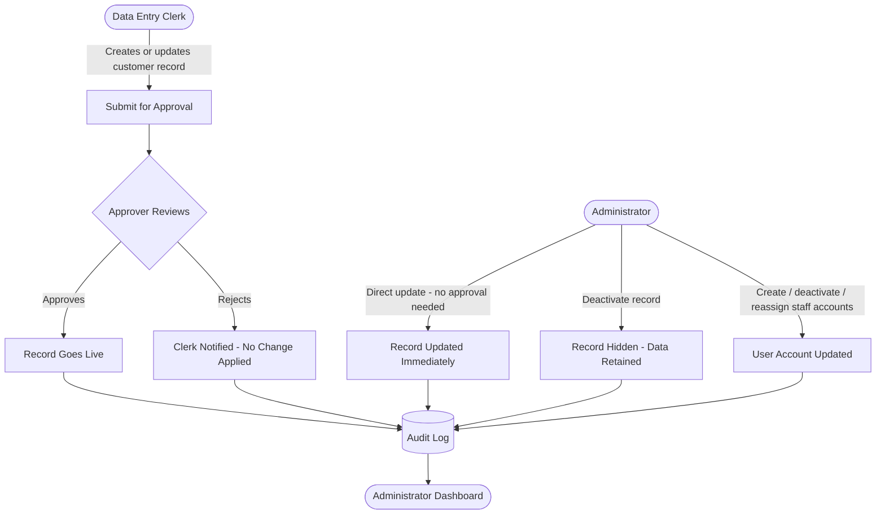
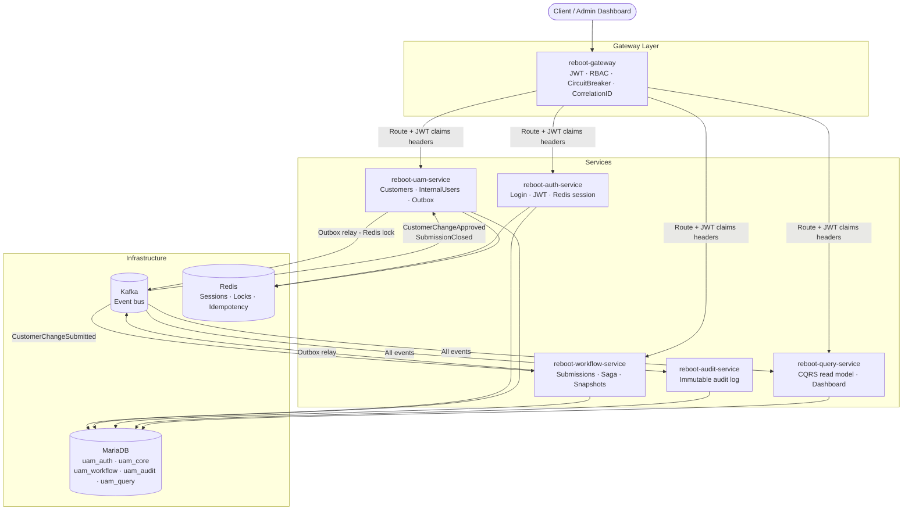
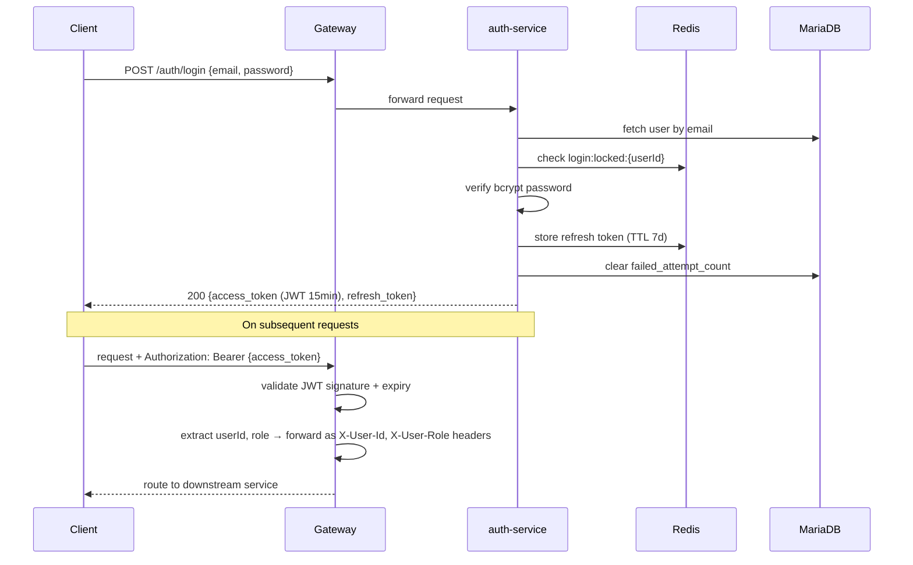
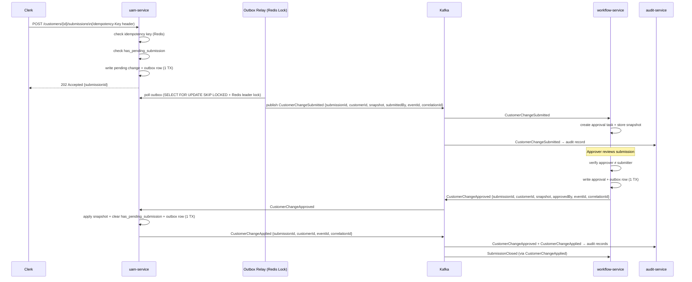
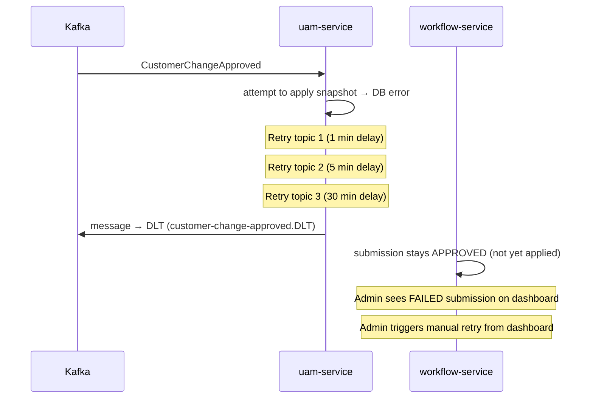
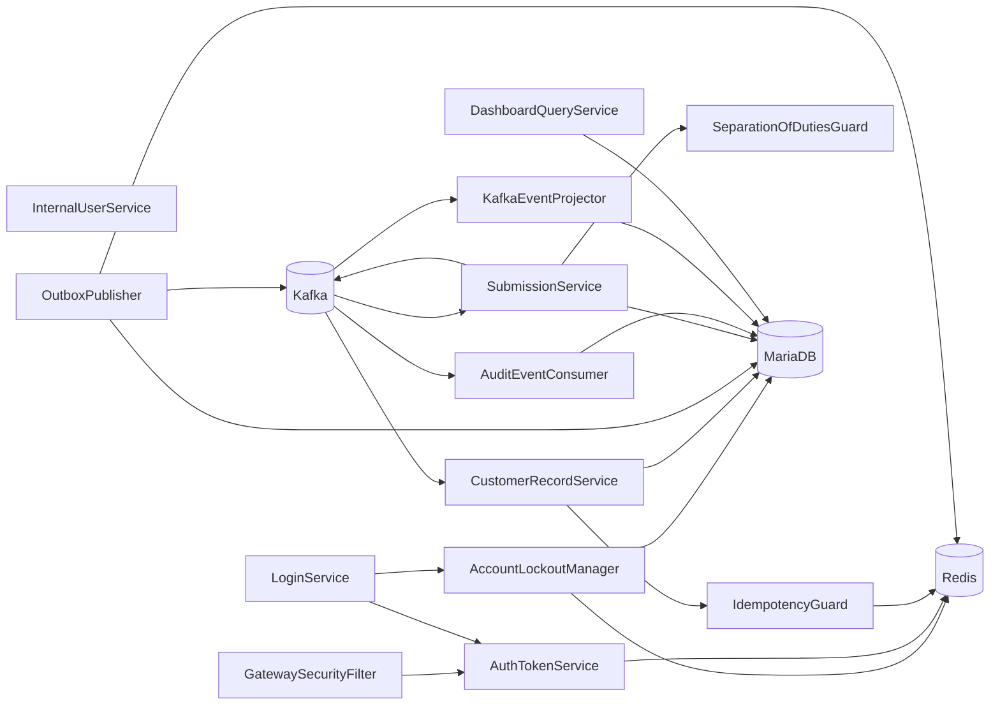

# Spec: Reboot-UAM — Microservices Patterns & Foundation

---

## Part 1 — Business Spec

> Audience: managers and business stakeholders. No technical jargon.

---

### Problem Statement

Reboot is building a digital financial services platform. Before any product (loans, payments, etc.) can be offered, the company needs a reliable way to manage who can access its internal systems and what they are allowed to do.

Right now, Reboot has no user management system. There is no way to create staff accounts, control what each person can see or do, manage customer records, or produce an audit trail of who changed what.

Without this foundation, every future product would have to build its own version of these controls — leading to inconsistent security, duplicated effort, and higher risk. The Loan Origination System (LOS), planned as the next product, will depend entirely on this foundation.

---

### Scope

The system is an **internal back-office platform** — Reboot staff use it to manage customer identity and access data. Customers do not interact with the system directly.

**What the system will do:**

- Allow administrators to create, manage, and deactivate internal staff accounts and assign roles
- Allow internal users to log in securely, maintain an active session, and log out
- Allow Data Entry Clerks to create and update customer records — all changes submitted for review before taking effect
- Allow Approvers to review, approve, or reject Clerk submissions — with strict separation: a Clerk cannot approve their own work
- Allow Administrators to update customer records directly (including sensitive identity fields) without going through the approval process
- Enforce role-based access controls across all functions
- Capture a complete, tamper-proof record of every action taken on customer records and user accounts
- Provide administrators with an operational dashboard showing pending approvals, active users, and recent account activity
- Continue operating normally even if part of the system is temporarily unavailable, and guarantee that no submitted data is ever lost

---

### Out of Scope

- Multi-factor authentication (SMS codes, authenticator apps)
- Social login (Google, Apple, etc.)
- Customer self-service — customers do not access this system
- Complex or dynamic permission hierarchies — roles are fixed at launch
- Bulk data import or migration
- Loan or financial product features
- User-facing frontend or mobile app
- Production cloud deployment

---

### User Stories

#### Administrator
- **US-1** — As an Administrator, I can create internal user accounts and assign a role, so that new staff can access the system with appropriate permissions.
- **US-2** — As an Administrator, I can deactivate an internal user account, so that access is immediately revoked when staff leave or change responsibilities.
- **US-3** — As an Administrator, I can change a user's role, so that responsibilities can be realigned without recreating the account.
- **US-4** — As an Administrator, I can view and update any customer record — including sensitive identity fields — without requiring approval, so that urgent corrections can be made immediately.
- **US-5** — As an Administrator, I can deactivate a customer record, so that it is hidden from active lists while all data is retained for compliance.
- **US-6** — As an Administrator, I can view an operational dashboard showing pending approvals, active users, and recent account activity, so that I have visibility into the state of the system at any time.

#### Internal User (all roles)
- **US-7** — As an internal user, I can log in with my email and password, so that I can access the functions permitted by my role.
- **US-8** — As an internal user, I can log out at any time, so that my session is immediately terminated and cannot be reused.
- **US-9** — As an internal user, my session is refreshed automatically while I am active, so that I am not unexpectedly logged out during work.
- **US-10** — As an internal user, I can view and update my own profile information, so that my details stay current.

#### Data Entry Clerk
- **US-11** — As a Data Entry Clerk, I can create new customer records and submit them for approval, so that new customers can be onboarded through a controlled process.
- **US-12** — As a Data Entry Clerk, I can update customer information and submit the changes for approval, so that corrections go through review before taking effect.

#### Approver
- **US-13** — As an Approver, I can review and approve or reject submissions from Clerks, so that data quality is maintained before changes go live.
- **US-14** — As an Approver, I am prevented from approving my own submissions, so that the maker-checker control is always enforced.

#### System (non-functional)
- **US-15** — As a system, if any part is temporarily unavailable, other parts continue to operate, so that staff are not blocked from submitting work.
- **US-16** — As a system, no submitted data is ever silently lost, so that every action is eventually processed regardless of failures.
- **US-17** — As a system, every action on customer records and user accounts is captured in a complete, immutable audit trail, so that incidents can be investigated and compliance requirements met.

---

### Acceptance Criteria

**AC for US-1, US-2, US-3:**
- An administrator can create an account with a name, email, employee ID, and role. Duplicate emails are rejected.
- Deactivating an account disables login immediately. The account remains visible in audit records.
- Changing a role takes effect immediately on the user's next action.

**AC for US-4, US-5:**
- An administrator can update any field on a customer record, including sensitive identity fields, and the change takes effect immediately.
- Deactivated customer records are excluded from active lists but visible in audit records.

**AC for US-6:**
- The dashboard shows: total active users, pending approvals count, rejected submissions count, and a feed of recent account activity. Data is near real-time (may be slightly delayed).

**AC for US-7, US-8, US-9:**
- Login with valid credentials succeeds. Invalid credentials are rejected with no indication of which field was wrong. After a configurable number of failed attempts, the account is locked for a defined period.
- Logout immediately prevents further use of the session.
- Sessions can be renewed while active without re-entering credentials.

**AC for US-10:**
- Users can update their own phone number. Role changes require an administrator.

**AC for US-11, US-12:**
- A Clerk can submit a new or updated customer record. The submission enters a pending state. A Clerk cannot submit a second change to the same customer while one is already pending.
- Submitting the same request twice (e.g. double-click) produces a single submission.

**AC for US-13, US-14:**
- An Approver can approve or reject any pending submission. Approval publishes the change. Rejection notifies the Clerk.
- An Approver cannot approve a submission they themselves created. The system rejects the attempt with a clear error.

**AC for US-15, US-16:**
- If the approval service is unavailable, Clerks can still submit records. Submissions are held and processed when the service recovers.
- No submitted record or approval decision is ever lost due to a system error. Failed operations are retried automatically.

**AC for US-17:**
- Every create, update, deactivate, approve, and reject action is logged with: who performed it, what changed, and when. Audit records cannot be modified or deleted.

---

### High-Level Flow

---

### Alternatives & Trade-offs (Business-Level)

| Decision | What we chose | Why |
|---|---|---|
| Approval workflow | Separate approval handling with an independent review step | Ensures a second pair of eyes on every customer change — critical for a financial platform. Meets maker-checker compliance requirements. |
| Administrator bypass | Admins can update records directly without approval | Admins are responsible for the overall system. Blocking them behind the Clerk workflow would slow urgent corrections. All admin changes are still fully audited. |
| Session handling | Sessions expire after inactivity and can be renewed silently | Balances security (expired sessions can't be hijacked) with usability (staff aren't interrupted mid-task). |
| Graceful degradation | Submissions held and retried if approval handling is unavailable | Staff should never lose work because of a backend issue. The system catches up automatically when services recover. |

---

## Part 2 — Technical Assessment

> Audience: developers and tech leads.

---

> **Estimation unit:** 1 manday = 1 hour (~2 sessions × 30 minutes). All estimates below use this unit.

---

### Architecture Diagram

---

### Workflow Diagrams

#### Authentication Flow

#### Approval Workflow — Choreography Saga Happy Path

#### Approval Workflow — Failure & Compensation Path

---

### Key Technical Decisions

| Decision | Choice | Rationale |
|---|---|---|
| Saga style | Choreography | Services communicate via domain events. No central orchestrator. Maximises loose coupling and teaches event-driven patterns. |
| Outbox relay | Polling + Redis distributed lock | Polling is operationally simple for this project. Redis leader election prevents dual-publishing across instances. Debezium deferred — adds Kafka Connect overhead. |
| Session management | JWT access token (15 min) + Redis refresh token (7 days) | Stateless validation at Gateway (no Redis hit per request). Logout is real — refresh token is invalidated in Redis immediately. |
| Account lockout state | Redis (active enforcement, TTL-based) + DB columns (audit, bootstrap) | Redis handles fast check on every login attempt; DB persists `failed_attempt_count` and `locked_until` for compliance and cold-start recovery. |
| RBAC enforcement | Gateway (coarse-grained, route-level) + service (fine-grained, business rules) | Gateway provides fast-fail on role mismatch. Separation of duties ("maker ≠ checker") requires business data — enforced only in the workflow service. |
| CQRS | Dedicated `reboot-query-service` | Dashboard data spans multiple services. Pre-aggregated read model avoids cross-service calls at query time. Fully decoupled from write side. |
| Idempotency | Client-supplied `Idempotency-Key` header + Redis (TTL 24h) | Prevents duplicate submissions from retries or double-clicks. Redis already in stack. |
| Concurrent submissions | One pending submission per customer at a time | Simplest rule that prevents snapshot conflicts. `has_pending_submission` flag on customer record, maintained via events from workflow-service. |
| Admin KYC bypass | Admins bypass approval entirely | Admin authority covers all fields. All admin KYC writes emit `AdminKycFieldUpdated` high-priority audit event. |
| Admin bootstrap | Flyway migration with bcrypt-hashed default password + `force_password_change = true` | No runtime secret injection required. Password must be changed on first login. |
| Idempotent consumers | `event_id` UUID unique constraint on `audit_log` and all consumer tables | Kafka guarantees at-least-once. Deduplication via DB unique constraint is simple and reliable. |

---

### Module Decomposition

> **Deep module principle:** each module below encapsulates significant behaviour behind a simple, stable interface. It can be developed and tested in isolation. Tests exercise the public interface — never internal state.

| Module | Service | Responsibility | Public Interface | New / Modified | Test Seam |
|---|---|---|---|---|---|
| `AuthTokenService` | auth-service | Issue, validate, and rotate JWTs and refresh tokens | `issue(userId, role)`, `validate(token)`, `rotate(refreshToken)` | New | Behavioral — test token shape and expiry against interface |
| `LoginService` | auth-service | Login flow: credential check, lockout integration, session creation | `login(email, password)`, `logout(refreshToken)`, `refresh(refreshToken)` | New | Behavioral via `POST /auth/login`, `POST /auth/logout` |
| `AccountLockoutManager` | auth-service | Track failed attempts in Redis + DB; enforce lockout TTL | `recordFailure(userId)`, `isLocked(userId)`, `reset(userId)` | New | Behavioral — lockout triggers at N failures, unlocks after TTL |
| `GatewaySecurityFilter` | gateway | JWT validation, claim extraction, RBAC route enforcement, correlation ID injection | Spring Cloud Gateway filter chain | New | Behavioral — invalid JWT → 401, wrong role → 403, valid → headers forwarded |
| `InternalUserService` | uam-service | Internal user CRUD, role assignment, account deactivation | `create(request)`, `deactivate(userId)`, `assignRole(userId, role)` | New | Behavioral via REST endpoints |
| `CustomerRecordService` | uam-service | Customer record CRUD, submission entry point, `has_pending_submission` check | `create(request)`, `update(id, request, idempotencyKey)`, `deactivate(id)` | New | Behavioral via REST endpoints |
| `IdempotencyGuard` | uam-service | Redis-backed idempotency check and response caching | `check(key)`, `store(key, response, ttl)` | New | Behavioral — duplicate key returns cached response |
| `OutboxPublisher` | uam-service, workflow-service | Transactional outbox relay with Redis distributed lock | `publishPending()` (scheduled) | New | Embedded Kafka — verify event published after DB write |
| `SubmissionService` | workflow-service | Full submission lifecycle: create task, approve, reject, enforce separation of duties | `onSubmitted(event)`, `approve(submissionId, approverId)`, `reject(submissionId, approverId, reason)` | New | Behavioral via REST + Kafka consumer |
| `SeparationOfDutiesGuard` | workflow-service | Verify approver ≠ submitter | `verify(submissionId, approverId)` throws `WORKFLOW-001` if violated | New | Behavioral — returns 403 on self-approval attempt |
| `AuditEventConsumer` | audit-service | Idempotent Kafka consumer; writes immutable audit records | Kafka `@KafkaListener` on all event topics | New | Embedded Kafka — verify audit record created; duplicate event = no duplicate record |
| `DashboardQueryService` | query-service | Pre-aggregated read model for admin dashboard | `getSummary()`, `getPendingApprovals(pageable)`, `getRecentActivity(pageable)` | New | Behavioral via REST — seed events, assert dashboard data |
| `KafkaEventProjector` | query-service | Consume all domain events and update read model; idempotent | Kafka `@KafkaListener` on all topics | New | Embedded Kafka — verify projection updated after event |

#### Module Dependency Diagram

---

### Dependencies

**Infrastructure (already in K8s manifests):**
- MariaDB — schemas: `uam_auth`, `uam_core`, `uam_workflow`, `uam_audit`, `uam_query`
- Kafka (KRaft) — single broker, NodePort `32480`
- Redis — NodePort `30380`

**New Gradle subprojects:**
- `reboot-workflow-service` (`com.reboot.uam.workflow`)
- `reboot-audit-service` (`com.reboot.uam.audit`)
- `reboot-query-service` (`com.reboot.uam.query`)

**Key library additions (applied where needed):**
- `spring-kafka` — all services publishing/consuming events
- `spring-data-redis` — auth-service, uam-service
- `redisson` or `spring-integration-redis` — uam-service (distributed lock)
- `resilience4j-spring-boot3` — gateway
- `spring-cloud-starter-gateway` — gateway
- `micrometer-tracing-bridge-otel` + `opentelemetry-exporter-otlp` — all services
- `flyway-core` + `flyway-mysql` — all services with a DB schema
- `mapstruct` + `lombok-mapstruct-binding` — all services
- `testcontainers-mariadb` + `testcontainers-kafka` — test scope, all services

---

### Task Breakdown

> Slices are ordered: each delivers a working, demoable end-to-end increment. Slice 0 unlocks TDD for everything that follows.

#### Slice 0: Test & Build Infrastructure

> After this slice: all 6 services compile, Testcontainers + embedded Kafka/Redis work in tests, base test classes are usable.

| # | Task | Complexity | Mandays | Risk | Covers |
|---|------|-----------|---------|------|--------|
| 1 | Gradle multi-project setup: settings.gradle, root build.gradle, 6 subprojects, common-lib as dependency | Low | 1 | Low | Foundation |
| 2 | `reboot-common-lib`: `ApiResponse<T>`, `RebootException` hierarchy, error code constants, `@RestControllerAdvice` base class | Low | 1 | Low | Foundation |
| 3 | Shared test harness: Testcontainers MariaDB + Kafka + Redis, base `@SpringBootTest` integration test class, embedded Kafka config | Medium | 1.5 | Medium | Foundation |

**Subtotal: 3.5 mandays**

---

#### Slice 1: Service Scaffolds & Infra Baseline

> After this slice: all 6 services boot, connect to K8s infra, and pass a health check. Flyway migrations initialise all schemas.

| # | Task | Complexity | Mandays | Risk | Covers |
|---|------|-----------|---------|------|--------|
| 4 | Scaffold `reboot-auth-service`, `reboot-uam-service`, `reboot-gateway`, `reboot-workflow-service`, `reboot-audit-service`, `reboot-query-service`: `application.properties`, Spring Boot main class, health endpoint | Low | 1.5 | Low | Foundation |
| 5 | Flyway baseline migrations: create schemas `uam_auth`, `uam_core`, `uam_workflow`, `uam_audit`, `uam_query` with audit columns and soft-delete convention. Seed default admin (bcrypt hash + `force_password_change = true`). | Low | 1 | Low | US-1 |
| 6 | K8s manifests for new services (ConfigMaps only — no Deployment/Service for app services per CLAUDE.md) | Low | 0.5 | Low | Foundation |

**Subtotal: 3 mandays**

---

#### Slice 2: Authentication & Session Management

> After this slice: a user can log in, receive tokens, refresh their session, and log out. Account lockout works. Gateway validates JWTs.

| # | Task | Complexity | Mandays | Risk | Covers |
|---|------|-----------|---------|------|--------|
| 7 | `AuthTokenService`: issue JWT (userId, role, email claims; 15 min TTL), validate, and parse claims. | Medium | 1 | Low | US-7, US-9 |
| 8 | `AccountLockoutManager`: Redis INCR on failure (`login:attempts:{userId}`), set `login:locked:{userId}` TTL on threshold, clear on success. DB columns `failed_attempt_count`, `locked_until`. Redis-first with DB fallback on cache miss. | Medium | 1.5 | Medium | US-7 |
| 9 | `LoginService`: `login()` — credential verification, lockout integration, refresh token stored in Redis. `logout()` — delete refresh token from Redis. `refresh()` — validate Redis refresh token, issue new access token. | Medium | 1.5 | Low | US-7, US-8, US-9 |
| 10 | `GatewaySecurityFilter`: validate JWT signature and expiry, extract claims, forward `X-User-Id`, `X-User-Role`, `X-Correlation-ID` headers. Coarse-grained RBAC: route-level role enforcement. Circuit Breaker + Bulkhead + Time Limiter (Resilience4j) on all downstream routes. | High | 2.5 | High | US-7, US-15 |

**Subtotal: 6.5 mandays**

---

#### Slice 3: Internal User Management & RBAC

> After this slice: an admin can create, deactivate, and reassign roles for internal users. Users can view and update their own profiles.

| # | Task | Complexity | Mandays | Risk | Covers |
|---|------|-----------|---------|------|--------|
| 11 | `InternalUserService`: create user (email unique constraint), deactivate (disables login), assign/change role. Flyway migration: `internal_users` table. MapStruct DTOs. `@RestControllerAdvice` per service. | Medium | 2 | Low | US-1, US-2, US-3 |
| 12 | Self-service profile: `GET /users/me`, `PATCH /users/me` (phone number only). Role-change endpoint restricted to ADMIN via Gateway RBAC. | Low | 1 | Low | US-10 |

**Subtotal: 3 mandays**

---

#### Slice 4: Customer Record Management

> After this slice: clerks can create and update customer records. Admins can update any field directly. Idempotency Key and Optimistic Lock work.

| # | Task | Complexity | Mandays | Risk | Covers |
|---|------|-----------|---------|------|--------|
| 13 | Flyway migration: `customer_records` table (`uam_core` schema), `outbox_events` table. Fields: name, email, phone, dob, national_id, address, nationality, occupation. Audit columns, soft-delete, `has_pending_submission` flag, `@Version` column. | Low | 1 | Low | US-11, US-12, US-4, US-5 |
| 14 | `CustomerRecordService` — Clerk path: `create()`, `update()` with `IdempotencyGuard` (Redis, `Idempotency-Key` header, 24h TTL). Enforces `has_pending_submission` check — returns `409` if a pending submission exists. | Medium | 2 | Medium | US-11, US-12 |
| 15 | Admin direct update path: `PUT /admin/customers/{id}` — bypasses `has_pending_submission` check, writes directly, emits `AdminKycFieldUpdated` event to outbox if KYC fields changed. Customer deactivation: `DELETE /admin/customers/{id}` (soft delete). Optimistic lock (`@Version`) on entity. | Medium | 1.5 | Low | US-4, US-5 |

**Subtotal: 4.5 mandays**

---

#### Slice 5: Approval Workflow — Choreography Saga

> After this slice: the full approval loop works end-to-end. Outbox reliably publishes events. Saga compensation (retries + DLT) is wired. Separation of duties is enforced.

| # | Task | Complexity | Mandays | Risk | Covers |
|---|------|-----------|---------|------|--------|
| 16 | Transactional Outbox infrastructure: `outbox_events` table in `uam_core` and `uam_workflow`. `OutboxPublisher` — `@Scheduled` polling with `SELECT FOR UPDATE SKIP LOCKED`, Redis distributed lock (leader election), publishes to Kafka, marks rows `PUBLISHED`. | High | 2.5 | High | US-15, US-16 |
| 17 | Workflow service — `SubmissionService`: consume `CustomerChangeSubmitted`, create approval task + snapshot (`uam_workflow.submissions`). Flyway migration: `submissions` table (submissionId, customerId, snapshot JSON, submittedBy, status, approvedBy, rejectedBy, reason). | Medium | 2 | Medium | US-13, US-14 |
| 18 | `SubmissionService` — approve/reject endpoints: `POST /submissions/{id}/approve`, `POST /submissions/{id}/reject`. `SeparationOfDutiesGuard` check. On approve: write outbox row → `CustomerChangeApproved`. On reject: write outbox row → `CustomerChangeRejected`. | Medium | 2 | Medium | US-13, US-14 |
| 19 | `uam-service` Saga consumer: consume `CustomerChangeApproved` → apply snapshot + clear `has_pending_submission` + emit `CustomerChangeApplied`. Consume `CustomerChangeRejected` → clear flag. Consume `SubmissionClosed` → update local flag. | Medium | 1.5 | Medium | US-13, US-16 |
| 20 | Retry topics + DLT: `@RetryableTopic` on `CustomerChangeApproved` consumer (retry-1: 1min, retry-2: 5min, retry-3: 30min). On DLT: set submission status `FAILED`, surface on dashboard. Manual retry endpoint: `POST /admin/submissions/{id}/retry`. | Medium | 2 | Medium | US-15, US-16 |

**Subtotal: 10 mandays**

---

#### Slice 6: Audit Service

> After this slice: every domain event produces an immutable audit record. Duplicate events produce a single record.

| # | Task | Complexity | Mandays | Risk | Covers |
|---|------|-----------|---------|------|--------|
| 21 | `reboot-audit-service`: Flyway migration: `audit_log` table (`event_id` UUID unique, `event_type`, `actor_id`, `resource_type`, `resource_id`, `payload` JSON, `correlation_id`, `occurred_at`). `AuditEventConsumer` subscribes to all Kafka topics. Idempotency via `uk_audit_log_event_id`. Immutable — no UPDATE/DELETE. | Medium | 2.5 | Low | US-17 |

**Subtotal: 2.5 mandays**

---

#### Slice 7: CQRS Dashboard (Query Service)

> After this slice: the admin dashboard returns live aggregated data from across all services via a single read endpoint.

| # | Task | Complexity | Mandays | Risk | Covers |
|---|------|-----------|---------|------|--------|
| 22 | `reboot-query-service`: Flyway migration: `dashboard_summary` table (active_users, pending_approvals, rejected_submissions), `recent_activity` table. `KafkaEventProjector` — idempotent consumer on all topics, updates read model. `event_id` unique constraint for deduplication. | Medium | 2 | Low | US-6 |
| 23 | `DashboardQueryService` REST endpoints: `GET /dashboard/summary`, `GET /dashboard/pending-approvals`, `GET /dashboard/recent-activity`. Admin-only via Gateway RBAC. | Low | 1 | Low | US-6 |

**Subtotal: 3 mandays**

---

#### Slice 8: Resilience & Observability

> After this slice: the system is fully observable end-to-end. Distributed traces, correlation IDs, and Prometheus metrics are all wired.

| # | Task | Complexity | Mandays | Risk | Covers |
|---|------|-----------|---------|------|--------|
| 24 | Correlation ID propagation: Gateway generates `X-Correlation-ID` (UUID if absent, pass-through if present). All services extract and put in MDC (`correlationId`). All Kafka event payloads include `correlationId` field. | Medium | 1 | Low | US-17 |
| 25 | Micrometer + OpenTelemetry: add `micrometer-tracing-bridge-otel` + OTLP exporter to all services. Wire Prometheus `/actuator/prometheus`. K8s manifests for Grafana + Tempo (observability stack in `reboot-common-k8s/observability/`). | Medium | 2 | Medium | US-6, US-17 |

**Subtotal: 3 mandays**

---

### Total Estimate & Critical Path

| Slice | Mandays |
|---|---|
| 0 — Test & Build Infrastructure | 3.5 |
| 1 — Service Scaffolds & Infra Baseline | 3 |
| 2 — Authentication & Session Management | 6.5 |
| 3 — Internal User Management & RBAC | 3 |
| 4 — Customer Record Management | 4.5 |
| 5 — Approval Workflow (Saga) | 10 |
| 6 — Audit Service | 2.5 |
| 7 — CQRS Dashboard | 3 |
| 8 — Resilience & Observability | 3 |
| **Total** | **39 mandays** |

**Critical path:** Slice 0 → 1 → 2 → 3 → 4 → 5 → 6 → 7 → 8 (strictly sequential — each slice depends on the previous).

At 2 sessions/day (~2 mandays/day), 39 mandays = ~20 working days (~4 weeks). This fits within the 6-week target with buffer for rework and learning overhead on the distributed patterns.

Slice 5 (Approval Workflow Saga) is the highest-risk slice at 10 mandays — the most complex, most novel, and most likely to surface unexpected edge cases. Treat it as the project's critical dependency.

---

### Risk Assessment

#### High Risks
- **Saga compensation complexity** — The DLT + manual retry path requires careful state management across two services. A bug here silently leaves submissions in an unresolvable state.
- **Outbox relay correctness** — The `SELECT FOR UPDATE SKIP LOCKED` + Redis leader lock combination must be tested under concurrent instances. A bug causes duplicate Kafka events that may slip past idempotency guards.
- **Gateway Resilience4j tuning** — Circuit breaker thresholds, bulkhead pool sizes, and timeout values affect all downstream services. Wrong values cause false positives (unnecessary tripping) or allow cascading failures through.

#### Medium Risks
- **Timeline pressure** — Slice 5 (10 mandays) is the longest. If it slips, Slices 6–8 compress or get cut.
- **Kafka consumer group management** — Multiple services consuming the same topics need careful consumer group naming. Misconfiguration causes missed events or duplicate consumption.
- **Redis single point of failure** — Redis is used for sessions, locks, and idempotency. There is no Redis Sentinel/Cluster in this setup. An outage affects login, outbox publishing, and idempotency simultaneously.
- **Snapshot staleness** — Admin edits to a canonical record while a Clerk submission is pending will create a discrepancy between the snapshot and the live record. The Approver sees the snapshot — they may not be aware of the admin's concurrent change.

#### Mitigation Strategies
- Write integration tests for the full Saga happy path + compensation path (embedded Kafka + Testcontainers) in Slice 5 before implementing retry/DLT.
- Document consumer group naming conventions explicitly before any Kafka consumer is coded.
- Surface snapshot age to the Approver in the review UI (out of scope for this spec but a future concern).
- Treat the 6-week timeline as a soft deadline — cut Slice 8 (observability) if Slice 5 overruns.

---

## Part 3 — Issue-Ready Breakdown

> Audience: `/to-issues` skill. Each issue is a self-contained, vertically-sliced work item. Issues are ordered so each slice builds on the previous.

---

> **TDD framing:** Each issue defines a **public interface** and **observable behaviors** to verify through it. Do NOT pre-specify test class names or bulk-list tests. Use a tracer bullet: ONE test → ONE implementation → repeat. Tests must verify behavior through public APIs only — never assert on internal state (DB rows, Redis keys, outbox tables, `@Version` columns).

> **Contract behavior:** Any issue introducing a Kafka producer/consumer pair includes a contract behavior asserting the event shape.

---

### Slice 0: Test & Build Infrastructure

> After this slice: all 6 services compile, shared test harness is usable, and TDD is unblocked for all subsequent slices.

#### ISSUE-1: Gradle multi-project setup, common-lib, and shared test harness
- **Description:** Configure the Gradle multi-project build with all 6 subprojects. Implement `reboot-common-lib` with `ApiResponse<T>`, `RebootException` hierarchy, service error code constants, and a `@RestControllerAdvice` base class. Create a shared `testFixtures` source set with Testcontainers (MariaDB), embedded Kafka, embedded Redis, and base `@SpringBootTest` classes that all integration tests extend.
- **User Stories:** Foundation for all US
- **Modules touched:** Foundation (shared test harness / build infra)
- **Public Interface:** `ApiResponse<T>` (common-lib), `BaseIntegrationTest` (testFixtures), `EmbeddedKafkaTest` (testFixtures)
- **Behaviors to verify (in priority order):**
  1. A service that throws a `RebootException` subclass returns `ApiResponse` with the correct error code and HTTP status
  2. A test extending `BaseIntegrationTest` can write to and read from a Testcontainers MariaDB instance without additional setup
  3. A test extending `EmbeddedKafkaTest` can publish and consume a Kafka message without additional setup
- **Acceptance Criteria:** All 6 subprojects compile with `./gradlew build`. Shared test fixtures are importable from any subproject's test scope.
- **Estimated Mandays:** 3.5
- **Dependencies:** None
- **Risk:** Low

---

### Slice 1: Service Scaffolds & Infra Baseline

> After this slice: all 6 services boot, connect to remote K8s infra, pass health checks, and Flyway initialises all schemas on startup.

#### ISSUE-2: Service scaffolds, Flyway baseline, and default admin seed
- **Description:** Scaffold all 6 Spring Boot services with `application.properties` (referencing `${INFRA_HOST:100.66.8.44}` for all infra endpoints), health endpoints, and Flyway configuration. Create baseline migrations for all schemas: `uam_auth`, `uam_core`, `uam_workflow`, `uam_audit`, `uam_query` — with audit columns (`created_at`, `created_by`, `updated_at`, `updated_by`) and soft-delete (`is_deleted`, `deleted_at`) on all tables. Seed the default admin account in `uam_auth` via a Flyway migration with a bcrypt-hashed default password and `force_password_change = true`.
- **User Stories:** Foundation, US-1
- **Modules touched:** Foundation
- **Public Interface:** `GET /actuator/health` on all services
- **Behaviors to verify (in priority order):**
  1. Each service returns `200 {"status": "UP"}` on `GET /actuator/health` when infra is reachable
  2. On first startup, Flyway creates all schemas and tables without error
  3. On subsequent startups, Flyway applies no migrations (idempotent)
  4. The default admin account exists in `uam_auth.internal_users` with `force_password_change = true`
- **Acceptance Criteria:** `./gradlew :reboot-auth-service:bootRun` (and each other service) starts without error against remote K8s infra.
- **Estimated Mandays:** 3
- **Dependencies:** ISSUE-1
- **Risk:** Low

---

### Slice 2: Authentication & Session Management

> After this slice: a user can log in, receive tokens, refresh their session, and log out. Account lockout works. The Gateway validates JWTs and forwards claims.

#### ISSUE-3: Login, logout, token refresh, and account lockout
- **Description:** Implement the full authentication flow in `reboot-auth-service`. `AuthTokenService` issues and validates JWTs (userId, role, email claims; 15 min TTL) and manages refresh tokens in Redis (7-day TTL). `AccountLockoutManager` increments a Redis counter on each failed login; on threshold, sets a TTL-based lock key and writes `failed_attempt_count` and `locked_until` to DB. On successful login, resets both. DB is the fallback if Redis is cold. `LoginService` ties these together: verifies bcrypt password, creates session, handles logout and refresh.
- **User Stories:** US-7, US-8, US-9
- **Modules touched:** `AuthTokenService` (new), `LoginService` (new), `AccountLockoutManager` (new)
- **Public Interface:** `POST /auth/login`, `POST /auth/logout`, `POST /auth/refresh`
- **Behaviors to verify (in priority order):**
  1. Valid credentials return `200` with `access_token` (JWT) and `refresh_token` in body
  2. Invalid password returns `401` — response is identical to unknown email (no user enumeration)
  3. After N failed attempts (N configurable), the account is locked — returns `423` with `AUTH-001` error code
  4. A locked account returns `423` even with the correct password until the lock TTL expires
  5. Successful login resets the failed attempt counter — a subsequent failure starts the count from 1
  6. `POST /auth/logout` with a valid refresh token returns `200`; the same refresh token then returns `401` on `POST /auth/refresh`
  7. `POST /auth/refresh` with a valid refresh token returns `200` with a new `access_token`
  8. `POST /auth/refresh` with an expired or unknown refresh token returns `401`
  9. On first login with `force_password_change = true`, response includes `force_password_change: true` flag
- **Acceptance Criteria:** Full auth flow works end-to-end against embedded Redis + Testcontainers MariaDB.
- **Estimated Mandays:** 4
- **Dependencies:** ISSUE-2
- **Risk:** Low

#### ISSUE-4: API Gateway — JWT validation, RBAC routing, Circuit Breaker, and Correlation ID
- **Description:** Implement `GatewaySecurityFilter` in `reboot-gateway`. Validate JWT signature and expiry on every request; extract `userId`, `role`, and `email` claims and forward as `X-User-Id`, `X-User-Role`, `X-User-Email` headers to downstream services. Generate or pass through `X-Correlation-ID` (UUID if absent). Enforce coarse-grained RBAC at route level (e.g. `POST /submissions/{id}/approve` → `APPROVER` only). Configure Resilience4j `CircuitBreaker`, `Bulkhead`, and `TimeLimiter` on each downstream route.
- **User Stories:** US-7, US-15
- **Modules touched:** `GatewaySecurityFilter` (new)
- **Public Interface:** All Gateway routes
- **Behaviors to verify (in priority order):**
  1. Request without `Authorization` header → `401`
  2. Request with expired JWT → `401`
  3. Request with valid JWT but wrong role for the route → `403`
  4. Request with valid JWT and correct role → forwarded to downstream service with `X-User-Id`, `X-User-Role`, `X-Correlation-ID` headers present
  5. `X-Correlation-ID` from client is preserved; absent header → Gateway generates a UUID
  6. When a downstream service is unavailable, Circuit Breaker trips after threshold and returns `503` instead of hanging
- **Acceptance Criteria:** All Gateway behaviors verifiable via MockMvc / WebTestClient with a stubbed downstream (WireMock).
- **Estimated Mandays:** 2.5
- **Dependencies:** ISSUE-3
- **Risk:** High — Resilience4j config tuning is iterative

---

### Slice 3: Internal User Management & RBAC

> After this slice: an admin can manage internal user accounts. Users can manage their own profiles.

#### ISSUE-5: Internal user CRUD, role assignment, and account deactivation
- **Description:** Implement `InternalUserService` in `reboot-uam-service`. Flyway migration: `internal_users` table in `uam_core` (id, full_name, email, employee_id, role, is_active, force_password_change, audit columns, soft-delete). Endpoints: create user, get user, list users, change role, deactivate. MapStruct for entity → DTO mapping. `@RestControllerAdvice` for this service. Duplicate email → `409` with `UAM-001`.
- **User Stories:** US-1, US-2, US-3
- **Modules touched:** `InternalUserService` (new)
- **Public Interface:** `POST /users`, `GET /users/{id}`, `GET /users`, `PATCH /users/{id}/role`, `DELETE /users/{id}`
- **Behaviors to verify (in priority order):**
  1. `POST /users` with valid payload returns `201` with created user (no password in response)
  2. `POST /users` with duplicate email returns `409` with `UAM-001` error code
  3. `DELETE /users/{id}` returns `200`; the user can no longer log in (auth-service returns `401`)
  4. `PATCH /users/{id}/role` with a valid role returns `200`; subsequent requests by that user are evaluated against the new role
  5. Non-admin requests to any of these endpoints return `403` (enforced at Gateway)
- **Acceptance Criteria:** All endpoints tested via MockMvc with Testcontainers MariaDB.
- **Estimated Mandays:** 2
- **Dependencies:** ISSUE-4
- **Risk:** Low

#### ISSUE-6: Internal user self-service profile
- **Description:** `GET /users/me` returns the authenticated user's profile (sourced from `X-User-Id` header). `PATCH /users/me` allows updating phone number only. Role changes via this endpoint return `403`. All roles have access.
- **User Stories:** US-10
- **Modules touched:** `InternalUserService` (modified)
- **Public Interface:** `GET /users/me`, `PATCH /users/me`
- **Behaviors to verify (in priority order):**
  1. `GET /users/me` returns the authenticated user's profile with correct fields
  2. `PATCH /users/me` with `phoneNumber` returns `200` with updated profile
  3. `PATCH /users/me` attempting to change role returns `403` with `UAM-002`
  4. Request without valid JWT (unauthenticated) returns `401` (Gateway rejects before reaching service)
- **Acceptance Criteria:** Tested via MockMvc with `X-User-Id` header set directly (unit boundary for the service).
- **Estimated Mandays:** 1
- **Dependencies:** ISSUE-5
- **Risk:** Low

---

### Slice 4: Customer Record Management

> After this slice: clerks can create and update customer records. Idempotency Key prevents duplicates. Admins can update and deactivate directly.

#### ISSUE-7: Customer record CRUD — Clerk path with Idempotency Key
- **Description:** Implement `CustomerRecordService` in `reboot-uam-service`. Flyway migration: `customer_records` table in `uam_core` (id, full_name, email, phone, dob, national_id, address, nationality, occupation, has_pending_submission, `@Version` column, audit columns, soft-delete). Implement `IdempotencyGuard` (Redis, `Idempotency-Key` header required on create/update, 24h TTL). Clerk create/update endpoints write directly to the customer record with status `DRAFT` — a subsequent slice adds the Saga event chain.
- **User Stories:** US-11, US-12
- **Modules touched:** `CustomerRecordService` (new), `IdempotencyGuard` (new)
- **Public Interface:** `POST /customers` (Clerk), `PATCH /customers/{id}` (Clerk)
- **Behaviors to verify (in priority order):**
  1. `POST /customers` with valid payload and `Idempotency-Key` header returns `201` with customer ID
  2. `POST /customers` with the same `Idempotency-Key` returns `201` with the same customer ID — no duplicate created
  3. `POST /customers` without `Idempotency-Key` header returns `400` with `UAM-003`
  4. `PATCH /customers/{id}` when `has_pending_submission = true` returns `409` with `UAM-004`
  5. Non-Clerk requests to Clerk endpoints return `403` (Gateway RBAC)
- **Acceptance Criteria:** Idempotency tested with concurrent duplicate requests — only one customer record created.
- **Estimated Mandays:** 2.5
- **Dependencies:** ISSUE-6
- **Risk:** Medium — Redis idempotency under concurrent load needs testing

#### ISSUE-8: Admin customer record update, deactivation, and Optimistic Lock
- **Description:** Admin-only endpoints in `CustomerRecordService`. `PUT /admin/customers/{id}` — full update, bypasses `has_pending_submission` check, no approval required. If KYC fields (`national_id`, `dob`, `address`, `nationality`, `occupation`) are changed, write an `AdminKycFieldUpdated` event to the outbox (wired to Kafka in Slice 5). `DELETE /admin/customers/{id}` — soft delete. Optimistic Lock (`@Version`) on the `customer_records` entity — concurrent admin updates return `409` with `UAM-005`.
- **User Stories:** US-4, US-5
- **Modules touched:** `CustomerRecordService` (modified)
- **Public Interface:** `PUT /admin/customers/{id}`, `DELETE /admin/customers/{id}`
- **Behaviors to verify (in priority order):**
  1. `PUT /admin/customers/{id}` returns `200` with updated record regardless of `has_pending_submission` state
  2. `DELETE /admin/customers/{id}` returns `200`; the record no longer appears in active customer list
  3. Concurrent updates from two admins to the same record — one succeeds (`200`), the other returns `409` with `UAM-005`
  4. Non-admin requests to admin endpoints return `403` (Gateway RBAC)
- **Acceptance Criteria:** Optimistic lock conflict tested via two concurrent requests in integration test.
- **Estimated Mandays:** 2
- **Dependencies:** ISSUE-7
- **Risk:** Low

---

### Slice 5: Approval Workflow — Choreography Saga

> After this slice: the full approval workflow runs end-to-end via Kafka events. Outbox reliably publishes. Retry topics and DLT handle failures. Separation of duties is enforced.

#### ISSUE-9: Transactional Outbox with Redis distributed lock poller
- **Description:** Implement `OutboxPublisher` in `uam-service` (and mirror for `workflow-service` in ISSUE-11). `outbox_events` table in both `uam_core` and `uam_workflow`: `id`, `topic`, `payload` (JSON), `status` (PENDING/PUBLISHED), `event_id` (UUID), `created_at`. `@Scheduled` poller uses `SELECT FOR UPDATE SKIP LOCKED` to claim rows. Acquires Redis distributed lock (Spring Integration `RedisLockRegistry`) before polling — only the lock holder publishes. Marks rows `PUBLISHED` after successful Kafka send. Lock TTL: 30 seconds with heartbeat renewal.
- **User Stories:** US-15, US-16
- **Modules touched:** `OutboxPublisher` (new)
- **Public Interface:** Kafka topics — events published by the outbox relay
- **Behaviors to verify (in priority order):**
  1. An event written to the outbox table is eventually published to the correct Kafka topic (verifiable via embedded Kafka consumer)
  2. If two instances attempt to poll simultaneously, each event is published exactly once (no duplicates on Kafka)
  3. If the service crashes after writing to the outbox but before publishing, the event is published on the next poll cycle
  4. **Contract:** A `CustomerChangeSubmitted` event published to `reboot.customer.change.submitted` is deserializable by `workflow-service` with fields: `submissionId`, `customerId`, `snapshot`, `submittedBy`, `eventId`, `correlationId`
- **Acceptance Criteria:** Two-instance concurrency test with embedded Kafka confirms exactly-once publish.
- **Estimated Mandays:** 2.5
- **Dependencies:** ISSUE-8
- **Risk:** High — distributed lock + `SKIP LOCKED` interaction must be tested under concurrency

#### ISSUE-10: Submission creation, snapshot, and Saga happy path
- **Description:** Wire the full Saga happy path. In `uam-service`: `PATCH /customers/{id}/submissions` triggers `CustomerRecordService` to write a pending change + outbox row (one transaction). In `workflow-service`: `SubmissionService` consumes `CustomerChangeSubmitted`, creates an approval task with full snapshot stored as JSON in `uam_workflow.submissions`. Approve endpoint: `POST /submissions/{id}/approve` — `SeparationOfDutiesGuard` checks `approverId != submittedBy`, writes outbox row → `CustomerChangeApproved`. `uam-service` consumes `CustomerChangeApproved`, applies snapshot, clears `has_pending_submission`, writes outbox row → `CustomerChangeApplied`. Reject endpoint: `POST /submissions/{id}/reject` → `CustomerChangeRejected` → `uam-service` clears flag. All event payloads include `eventId` (UUID) and `correlationId`.
- **User Stories:** US-11, US-12, US-13, US-14, US-16
- **Modules touched:** `CustomerRecordService` (modified), `SubmissionService` (new), `SeparationOfDutiesGuard` (new), `OutboxPublisher` (modified — wf-service)
- **Public Interface:** `PATCH /customers/{id}/submissions`, `POST /submissions/{id}/approve`, `POST /submissions/{id}/reject`
- **Behaviors to verify (in priority order):**
  1. `PATCH /customers/{id}/submissions` returns `202 Accepted` with `submissionId`; `has_pending_submission` is `true` on the customer (observable via `GET /customers/{id}`)
  2. `POST /submissions/{id}/approve` by an approver who did not create the submission returns `200`; customer record reflects the snapshot values (observable via `GET /customers/{id}`)
  3. `POST /submissions/{id}/approve` by the same user who submitted returns `403` with `WORKFLOW-001`
  4. `POST /submissions/{id}/reject` returns `200`; `has_pending_submission` is `false` on the customer; customer record is unchanged
  5. A second `PATCH /customers/{id}/submissions` while `has_pending_submission = true` returns `409`
  6. **Contract (CustomerChangeSubmitted):** event on `reboot.customer.change.submitted` is deserializable by `workflow-service` with fields: `submissionId`, `customerId`, `snapshot` (all customer fields), `submittedBy`, `eventId`, `correlationId`
  7. **Contract (CustomerChangeApproved):** event on `reboot.customer.change.approved` is deserializable by `uam-service` with fields: `submissionId`, `customerId`, `snapshot`, `approvedBy`, `eventId`, `correlationId`
- **Acceptance Criteria:** Full Saga happy path tested end-to-end with embedded Kafka + Testcontainers MariaDB.
- **Estimated Mandays:** 5.5
- **Dependencies:** ISSUE-9
- **Risk:** High — most complex issue in the spec; Saga state machine across two services

#### ISSUE-11: Retry topics, DLT, and manual retry
- **Description:** Configure `@RetryableTopic` on `uam-service`'s `CustomerChangeApproved` consumer: retry-1 (1 min), retry-2 (5 min), retry-3 (30 min). After exhaustion, message goes to `reboot.customer.change.approved.DLT`. A `KafkaListenerErrorHandler` on the DLT transitions the submission to `FAILED` status in `workflow-service` (by publishing a `SubmissionFailed` event). Surface `FAILED` submissions on the admin dashboard. Admin manual retry endpoint: `POST /admin/submissions/{id}/retry` republishes the event from the DLT handler.
- **User Stories:** US-15, US-16
- **Modules touched:** `SubmissionService` (modified), `OutboxPublisher` (modified)
- **Public Interface:** `POST /admin/submissions/{id}/retry`, DLT consumer
- **Behaviors to verify (in priority order):**
  1. If `uam-service` fails to process `CustomerChangeApproved` on the first attempt, it retries (observable via consumer offset progression in embedded Kafka)
  2. After all retry topics are exhausted, the submission status becomes `FAILED` (observable via `GET /submissions/{id}`)
  3. `POST /admin/submissions/{id}/retry` on a `FAILED` submission re-triggers the application and returns `202`
  4. A successfully re-processed retry results in the customer record reflecting the snapshot (observable via `GET /customers/{id}`)
- **Acceptance Criteria:** Failure injection test (mock DB failure) confirms retry progression and DLT landing.
- **Estimated Mandays:** 2
- **Dependencies:** ISSUE-10
- **Risk:** Medium — retry topic + DLT wiring in Spring Kafka requires careful config

---

### Slice 6: Audit Service

> After this slice: every domain event produces an immutable audit record. Duplicate events are deduplicated.

#### ISSUE-12: Audit service — idempotent consumer and immutable audit log
- **Description:** Implement `AuditEventConsumer` in `reboot-audit-service`. Subscribes to all domain event topics: `reboot.customer.change.submitted`, `reboot.customer.change.approved`, `reboot.customer.change.applied`, `reboot.customer.change.rejected`, `reboot.customer.created`, `reboot.customer.deactivated`, `reboot.user.created`, `reboot.user.deactivated`, `reboot.user.role.changed`, `reboot.admin.kyc.updated`. Writes to `uam_audit.audit_log` with unique constraint on `event_id`. No UPDATE or DELETE operations on this table. Flyway migration: `audit_log` table.
- **User Stories:** US-17
- **Modules touched:** `AuditEventConsumer` (new)
- **Public Interface:** Kafka consumers on all domain topics; `GET /audit/{resourceType}/{resourceId}` (admin only)
- **Behaviors to verify (in priority order):**
  1. After a `CustomerChangeApplied` event is published, an audit record exists for that event (observable via `GET /audit/customer/{customerId}`)
  2. Receiving the same event twice (same `eventId`) produces exactly one audit record
  3. Audit records returned by `GET /audit/customer/{customerId}` include `actorId`, `eventType`, `correlationId`, and `occurredAt`
  4. No audit record can be deleted via any API endpoint (no DELETE on audit routes)
- **Acceptance Criteria:** Deduplication tested by publishing the same event twice to embedded Kafka and asserting one audit record.
- **Estimated Mandays:** 2.5
- **Dependencies:** ISSUE-11
- **Risk:** Low

---

### Slice 7: CQRS Dashboard

> After this slice: the admin dashboard returns aggregated live data from across all services via a single read endpoint.

#### ISSUE-13: Query service — pre-aggregated read model and dashboard endpoints
- **Description:** Implement `KafkaEventProjector` in `reboot-query-service`. Subscribes to all domain event topics and updates a pre-aggregated read model in `uam_query`: `dashboard_summary` (active_users, pending_approvals, failed_submissions) and `recent_activity` (ring buffer of last N events). Idempotent projection via `event_id` unique constraint. `DashboardQueryService` exposes: `GET /dashboard/summary`, `GET /dashboard/pending-approvals`, `GET /dashboard/recent-activity`. Admin-only via Gateway RBAC.
- **User Stories:** US-6
- **Modules touched:** `KafkaEventProjector` (new), `DashboardQueryService` (new)
- **Public Interface:** `GET /dashboard/summary`, `GET /dashboard/pending-approvals`, `GET /dashboard/recent-activity`
- **Behaviors to verify (in priority order):**
  1. After a `CustomerChangeSubmitted` event is published, `GET /dashboard/summary` reflects an incremented `pending_approvals` count
  2. After a `CustomerChangeApproved` event is published, `GET /dashboard/summary` reflects a decremented `pending_approvals` count
  3. `GET /dashboard/recent-activity` includes an entry for a recently processed event with `eventType`, `actorId`, `resourceId`, and `occurredAt`
  4. Receiving the same event twice does not double-count metrics
  5. Non-admin requests return `403` (Gateway RBAC)
- **Acceptance Criteria:** Full projection cycle tested with embedded Kafka: publish events → assert dashboard reflects changes.
- **Estimated Mandays:** 3
- **Dependencies:** ISSUE-12
- **Risk:** Low

---

### Slice 8: Resilience & Observability

> After this slice: the system is fully observable. Correlation IDs flow end-to-end. Prometheus metrics and distributed traces are available.

#### ISSUE-14: Correlation ID propagation across HTTP and Kafka
- **Description:** Ensure `correlationId` flows end-to-end. Gateway generates `X-Correlation-ID` (UUID) if absent. All services extract it from the `X-Correlation-ID` header and put it into `MDC` on every request (`correlationId` key). All Kafka event payloads already include `correlationId` (from Slice 5). Kafka consumers extract `correlationId` from the event payload and put it into MDC before processing. All log lines therefore carry the correlation ID automatically via the SLF4J pattern.
- **User Stories:** US-17
- **Modules touched:** All services
- **Public Interface:** All service log output; `X-Correlation-ID` response header
- **Behaviors to verify (in priority order):**
  1. A request with a client-provided `X-Correlation-ID` value produces log lines in downstream services containing that same value
  2. A request without `X-Correlation-ID` produces a Gateway-generated UUID that appears in all downstream log lines for that request
  3. A Kafka event consumed by `audit-service` produces log lines containing the `correlationId` from the event payload
- **Acceptance Criteria:** Log output verified in integration test via log appender capture.
- **Estimated Mandays:** 1
- **Dependencies:** ISSUE-13
- **Risk:** Low

#### ISSUE-15: Micrometer, OpenTelemetry, Prometheus, and Grafana/Tempo
- **Description:** Add `micrometer-tracing-bridge-otel` and `opentelemetry-exporter-otlp` to all services. Configure OTLP exporter to point at Tempo (via `${INFRA_HOST}`). Expose `GET /actuator/prometheus` on all services. Add K8s manifests in `reboot-common-k8s/observability/` for Grafana and Tempo (Deployments, Services, ConfigMaps). Verify distributed trace spans link across Gateway → downstream service for a single request.
- **User Stories:** US-6, US-17
- **Modules touched:** All services; `reboot-common-k8s/observability/`
- **Public Interface:** `GET /actuator/prometheus` on all services; Grafana/Tempo UIs
- **Behaviors to verify (in priority order):**
  1. `GET /actuator/prometheus` on each service returns a non-empty response containing standard Spring Boot metrics (`http_server_requests_seconds`, `jvm_memory_used_bytes`)
  2. A login request produces a distributed trace in Tempo with spans from both Gateway and `auth-service` sharing the same trace ID
- **Acceptance Criteria:** Grafana dashboard loads and shows metrics from at least one service. Tempo shows at least one multi-span trace.
- **Estimated Mandays:** 2
- **Dependencies:** ISSUE-14
- **Risk:** Medium — OTLP exporter config against remote Tempo requires K8s infra to be running
