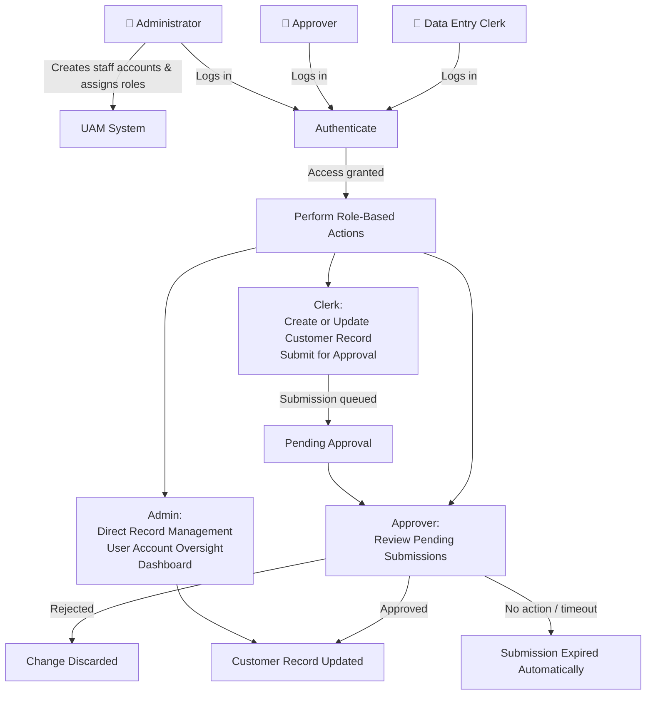
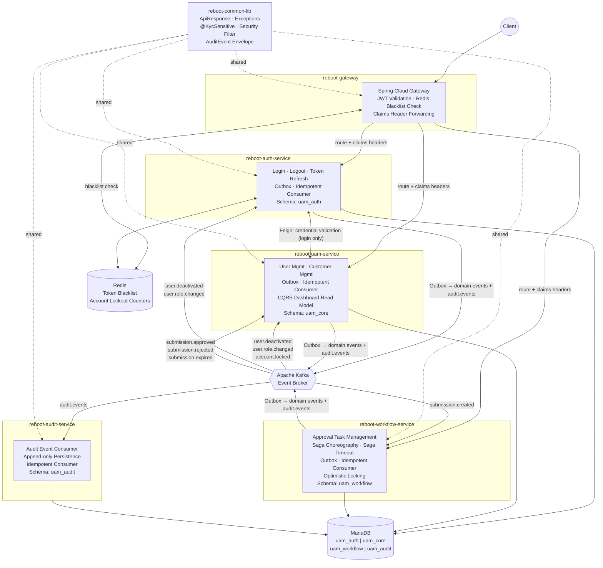
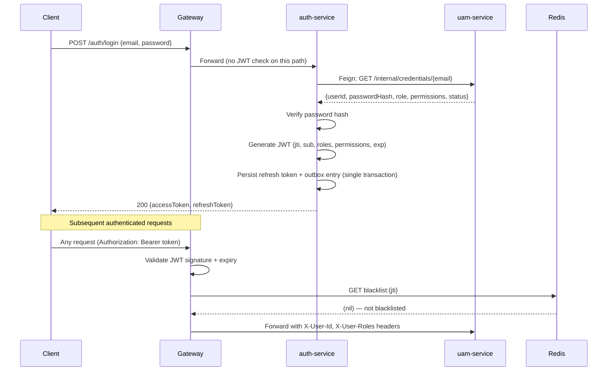
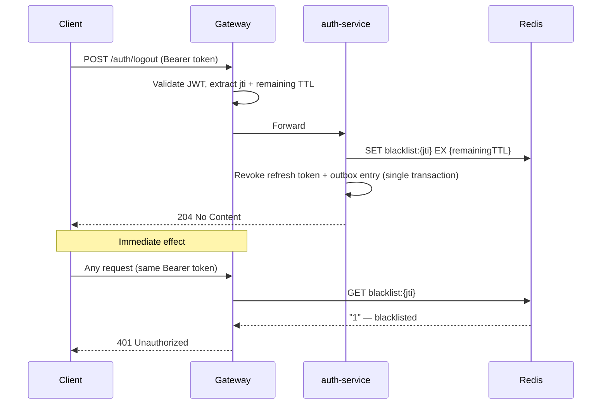
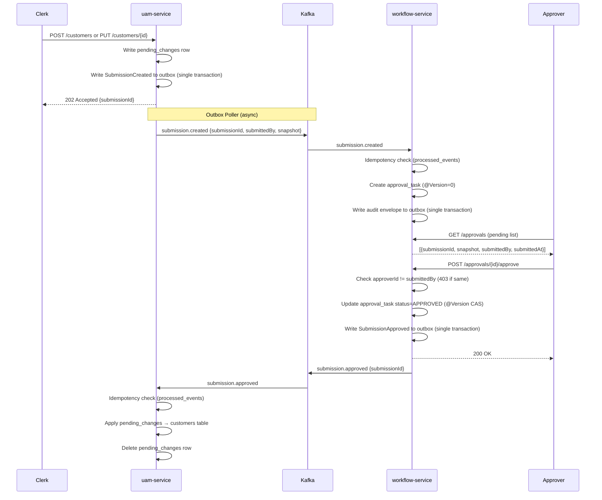
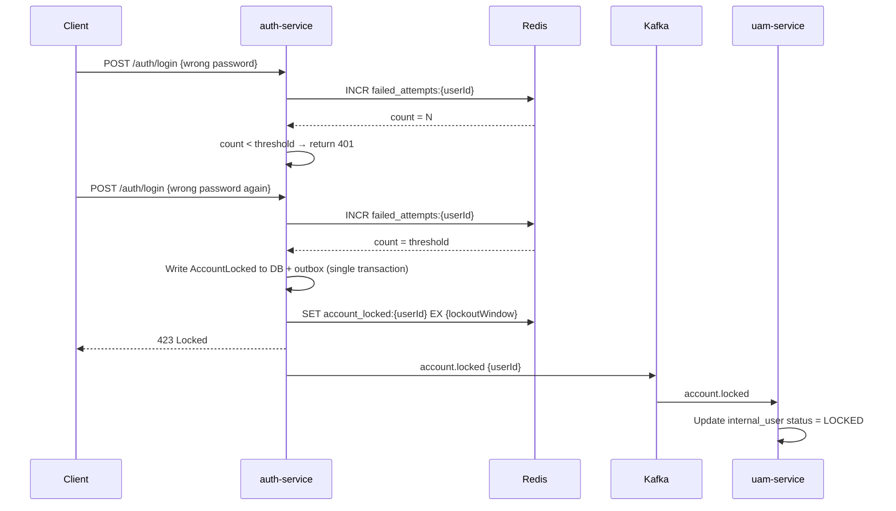
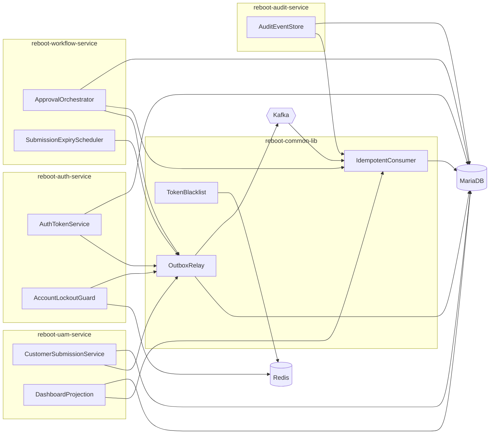

# Spec: Reboot-UAM Microservices Patterns & Foundation

---

## Part 1 — Business Spec

### Problem Statement

Reboot is a digital financial services company currently building its platform from the ground up. It has no existing system for managing staff identities, login access, or customer records. Without this foundation, every future product would need to build its own user management from scratch — leading to duplicated effort, inconsistent security, and compounding technical debt.

This project delivers the **User Access Management (UAM) system** — Reboot's central back-office platform for managing internal staff accounts, customer identity records, and access control. It is the first and most critical building block of the platform. The upcoming **Loan Origination System** depends directly on UAM to handle all user and access management so that the loan product can focus purely on loan-specific features.

---

### Scope

- Internal staff account creation and role assignment (by administrators only — no self-registration)
- Login, logout, and secure session management for all internal staff
- Customer record management: create, update, and deactivate customer profiles including identity and KYC data
- Maker-checker approval workflow: Clerks submit changes, Approvers review and decide
- Role-Based Access Control (RBAC): three fixed roles — Data Entry Clerk, Approver, Administrator
- Self-service profile management for internal users
- Immutable audit trail of every action on customer records and staff accounts
- Operational dashboard for administrators: active users, pending approvals, rejected submissions
- System reliability: no submitted data is ever silently lost; the system continues operating when a component is temporarily unavailable

---

### Out of Scope

- Multi-factor authentication (SMS codes, authenticator apps)
- Social login (Google, Microsoft, etc.)
- Customer self-service portal — customers do not use this system directly
- Complex or dynamic permission hierarchies
- Bulk data import or migration
- Any loan or financial product features (deferred to the Loan Origination System)
- User-facing frontend or UI
- Production cloud deployment

---

### User Stories

**Administrator**

- **US-1** — As an Administrator, I can create internal user accounts with assigned roles so that staff can access the system on their first day.
- **US-2** — As an Administrator, I can deactivate an internal user account so that departing staff immediately lose access.
- **US-3** — As an Administrator, I can change any user's role so that access reflects current responsibilities.
- **US-4** — As an Administrator, I can create, update, and deactivate customer records (including KYC fields) without requiring approval so that I can resolve issues efficiently.
- **US-5** — As an Administrator, I can view an operational dashboard showing active users, pending approvals, and rejected submissions so that I have full visibility into system health.

**Data Entry Clerk**

- **US-6** — As a Data Entry Clerk, I can create a new customer record and submit it for approval so that new customers are onboarded accurately.
- **US-7** — As a Data Entry Clerk, I can update customer information and submit changes for approval so that records remain current.

**Approver**

- **US-8** — As an Approver, I can view pending submissions with full details so that I can make an informed decision.
- **US-9** — As an Approver, I can approve or reject a submission so that valid changes are applied and invalid ones are discarded.
- **US-10** — As an Approver, I cannot approve a submission I personally submitted so that the maker-checker principle is enforced at all times.

**Any Internal User**

- **US-11** — As an internal user, I can log in with my email and password so that I can access the system.
- **US-12** — As an internal user, I can log out at any time and my session is immediately invalidated so that my account is protected.
- **US-13** — As an internal user, I can view and update my own profile information so that my details stay accurate.
- **US-14** — As an internal user, my session is automatically renewed during active use so that I do not need to log in repeatedly.
- **US-15** — As an internal user, my account is temporarily locked after repeated failed login attempts so that brute-force attacks are blocked.

---

### Acceptance Criteria

**AC for US-1, US-2, US-3:**
- An administrator can create a new internal user account via the API with name, email, employee ID, and a role (Clerk, Approver, or Administrator).
- Deactivating an account immediately disables login; any active session is invalidated.
- An administrator can change any user's role; the affected user's active session is invalidated and they must re-login with updated permissions.
- All account management actions appear in the immutable audit trail.

**AC for US-4:**
- An administrator can create, update (including KYC fields), and deactivate customer records without submitting for approval.
- Deactivated customer records are hidden from active lists but retained in the system.

**AC for US-5:**
- An administrator can query a dashboard endpoint returning: total active internal users, total pending submissions, total rejected submissions.
- Dashboard data is eventually consistent — counts reflect all processed events.

**AC for US-6, US-7:**
- A Clerk can submit a new or updated customer record; the submission enters a pending state.
- The Clerk cannot approve their own submission.
- If the approval system is temporarily unavailable, the submission is queued and eventually processed without data loss.

**AC for US-8, US-9, US-10:**
- An Approver can retrieve a list of pending submissions, each with the full snapshot of proposed changes.
- An Approver can approve or reject a submission with an optional reason.
- Approving a submission applies the pending changes to the customer record.
- Rejecting a submission discards the pending changes; the active customer record is unchanged.
- Attempting to approve one's own submission returns a 403 error.
- A submission with no decision after a configured timeout is automatically expired.

**AC for US-11, US-12, US-13, US-14, US-15:**
- Valid credentials return an access token and a refresh token.
- Invalid credentials return a 401 without revealing which field is incorrect.
- After logout, the access token is immediately rejected by the gateway.
- Profile view and update (phone number) work via authenticated endpoints.
- Token refresh returns a new access token without requiring re-login (while refresh token is valid).
- After N consecutive failed login attempts, login returns 423 and subsequent attempts are blocked until the lockout window expires.

---

### High-Level Flow

---

### Alternatives & Trade-offs (Business-Level)

**Approval workflow is asynchronous.** Clerk submissions are queued so that even if the approval system is momentarily unavailable, no data is lost. Submissions are processed when the system recovers automatically. The trade-off is that approvals are not instant — there is a brief delay between submission and the change appearing in the approval queue.

**A submission that is never acted upon expires automatically.** Rather than letting pending submissions pile up indefinitely, a configurable timeout automatically rejects stale submissions. This keeps the approval queue clean and avoids orphaned records. The trade-off is that a legitimate submission may expire if Approvers are unavailable for an extended period — an edge case that operations can monitor via the dashboard.

**Strict separation of maker and checker.** The system technically prevents a Clerk from approving their own submission, enforced in the system itself rather than relying on procedure alone. This is non-negotiable for compliance and cannot be bypassed.

**No real-time dashboard.** The dashboard reflects events as they are processed, not instantaneous counts. For an operational dashboard, a slight delay (seconds) is acceptable and greatly simplifies the system architecture.

---

## Part 2 — Technical Assessment

---

> **Estimation Unit**
> **1 manday = 1 hour** (~2 sessions × 30 minutes). All estimates below use this unit.

---

### Architecture Diagram

---

### Workflow Diagrams

#### Login Flow

#### Logout Flow

#### Maker-Checker Saga (Happy Path)

#### Account Lockout Flow

---

### Key Technical Decisions

| Pattern | Applied To | Rationale |
|---|---|---|
| **Saga Choreography** | Maker-checker approval workflow | Linear flow (Submit → Approve → Apply) fits choreography without needing a central orchestrator. Services react to events without coupling. |
| **Transactional Outbox** | All Kafka-producing services | Guarantees DB write and Kafka publish succeed atomically. Prevents silent data loss from partial failures between write and publish. |
| **Idempotent Consumers** | All Kafka-consuming services | Kafka at-least-once delivery can duplicate events. `processed_events` table deduplicates using event IDs within the same DB transaction as the business write. |
| **Optimistic Locking** | `approval_tasks` in workflow-service | Prevents two Approvers from concurrently acting on the same submission. `@Version` handled automatically by JPA. |
| **Cache-Aside (Token Blacklist)** | Gateway + auth-service | JWT access tokens are stateless; Redis blacklist (keyed by `jti`) enables immediate invalidation on logout. TTL matches token remaining expiry — no cleanup job needed. |
| **Cache-Aside (Account Lockout)** | auth-service | Redis `INCR` with TTL tracks failed attempts atomically. Fast-path check on every login. DB records durable locked status as fallback if Redis is unavailable. |
| **Event-Carried State Transfer** | `SubmissionCreated` event | Includes full pending data snapshot so `workflow-service` is self-sufficient for Approver review — no callback to `uam-service` needed, preserving graceful degradation. |
| **Saga Timeout** | workflow-service `@Scheduled` | Pending submissions that are never acted upon expire automatically. Configurable threshold via `application.yml`. Publishes `SubmissionExpired` event as compensating action. |
| **CQRS Read Model** | Operational dashboard in uam-service | Dashboard is a read-only aggregation across multiple services. A `dashboard_summary` table maintained by consuming Kafka events provides fast single-query reads with no cross-service calls at query time. |
| **`@KycSensitive` annotation** | Customer request DTOs | Declarative, co-located field marking. Reflection-based processor identifies which KYC-sensitive fields changed, driving submission routing. Audit-safe and deploy-gated (changing requires code deploy, intentional). |
| **`pending_changes` table** | uam-service | Clean separation between approved (`customers`) and proposed state. `customers` always reflects the last approved data — safe to read at any time. Pending changes are applied on `SubmissionApproved`, discarded on `SubmissionRejected`/`SubmissionExpired`. |
| **Dedicated `audit.events` topic** | All services → audit-service | Single stable contract for audit-service. Each producing service publishes a standardised `AuditEvent` envelope alongside domain events. Decouples audit-service from domain schema evolution. |
| **One Kafka topic per event type** | All Kafka topics | Precise consumer subscriptions. Consumers subscribe only to the topics they need. Avoids schema fan-out noise. |

---

### Module Decomposition

> **Deep module principle:** A deep module encapsulates significant functionality behind a simple, stable interface. Prefer fewer, deeper modules over many shallow ones. Each module below is a unit that can be developed and tested in isolation.

| Module | Service | Responsibility | Public Interface | New / Modified | Test Seam |
|---|---|---|---|---|---|
| `AuthTokenService` | auth-service | Issue JWT access tokens, validate tokens, manage refresh token lifecycle | `issue(userId, roles, permissions)`, `refresh(refreshToken)`, `revoke(refreshToken)` | New | Behavioral tests + Testcontainers MariaDB |
| `AccountLockoutGuard` | auth-service | Track failed login attempts in Redis, enforce lockout threshold, auto-release via TTL | `recordFailure(userId)`, `isLocked(userId)`, `lock(userId)` | New | Behavioral tests with embedded Redis |
| `TokenBlacklist` | gateway + auth-service | Write JTI to Redis on logout; check blacklist on every authenticated request | `blacklist(jti, ttlSeconds)`, `isBlacklisted(jti)` | New | Behavioral tests with embedded Redis |
| `OutboxRelay` | auth, uam, workflow | Atomically write domain events to outbox table within caller's transaction; background poller publishes to Kafka with retry | `publish(event, topic)` | New (per service) | Embedded Kafka integration test |
| `IdempotentConsumer` | auth, uam, workflow, audit | Deduplicate Kafka events via `processed_events` table; execute handler exactly once per event ID | `processIfNew(eventId, handler)` | New (per service) | Embedded Kafka + Testcontainers MariaDB |
| `CustomerSubmissionService` | uam-service | Route Clerk submissions to `pending_changes`; apply or discard changes on saga completion | `submit(clerkId, customerId, payload)`, `applyApproved(submissionId)`, `discard(submissionId)` | New | Behavioral tests via HTTP endpoints |
| `ApprovalOrchestrator` | workflow-service | Create approval tasks from events; enforce separation of duties; apply optimistic lock on decisions | `createTask(submissionEvent)`, `approve(taskId, approverId)`, `reject(taskId, approverId, reason)` | New | Behavioral tests via HTTP + embedded Kafka |
| `SubmissionExpiryScheduler` | workflow-service | Periodic scan of stale PENDING tasks; publish `SubmissionExpired` for each as compensating action | `expire()` (triggered by `@Scheduled`) | New | Integration test with `threshold=0` in test config |
| `DashboardProjection` | uam-service | CQRS read model: consume domain events, maintain `dashboard_summary` counts, serve via query endpoint | `query() → DashboardSummary` | New | Embedded Kafka + Testcontainers MariaDB |
| `AuditEventStore` | audit-service | Append-only persistence of `AuditEvent` envelopes; idempotent on `auditId` | `persist(auditEvent)` | New | Testcontainers MariaDB (INSERT-only DB user) |

#### Module Dependency Diagram

---

### Dependencies

**Infrastructure:**
- MariaDB (single instance, 4 schemas: `uam_auth`, `uam_core`, `uam_workflow`, `uam_audit`)
- Apache Kafka
- Redis
- Kubernetes (target deployment runtime)

**Libraries & Frameworks:**
- Java 21 + Spring Boot 3.3.x
- Spring Cloud Gateway
- OpenFeign + Resilience4j (circuit breaker on auth → UAM Feign call)
- MapStruct (entity ↔ DTO mapping)
- Lombok (`@Slf4j`, `@RequiredArgsConstructor`, etc.)
- Flyway (schema migrations per service)
- Micrometer + OpenTelemetry + Prometheus + Grafana + Tempo (observability)
- Testcontainers (MariaDB, Kafka, Redis — integration tests)
- WireMock (Feign contract tests)
- MockMvc (REST endpoint contract tests)

---

### Task Breakdown

#### Slice 0: Test & Build Infrastructure

> After this slice: all 5 services compile and start; the test harness runs against real MariaDB, Kafka, and Redis containers. No business logic yet — this enables TDD for every subsequent slice.

| # | Task | Complexity | Mandays | Risk | Covers |
|---|---|---|---|---|---|
| 1 | Gradle multi-module project setup (5 services + common-lib). `reboot-common-lib`: `ApiResponse<T>`, exception hierarchy (`RebootException` → `ResourceNotFoundException`, `DuplicateResourceException`, `BusinessRuleException`, `UnauthorizedException`, `ForbiddenException`, `ServiceCommunicationException`), `@KycSensitive` annotation, `AuditEvent` envelope, shared JWT security filter, `@RestControllerAdvice` base. | Medium | 4 | Low | Foundation |
| 2 | Test harness: Testcontainers base configs (MariaDB, Kafka, Redis), `AbstractIntegrationTest` base class, MockMvc base class, embedded Kafka consumer test utilities, Docker Compose for local dev environment. | Medium | 4 | Low | Foundation |

**Slice 0 Subtotal: 8 mandays**

---

#### Slice 1: Authentication Foundation

> After this slice: a user can log in and receive a JWT, make authenticated requests through the gateway, and log out with immediate session invalidation via Redis blacklist.

| # | Task | Complexity | Mandays | Risk | Covers |
|---|---|---|---|---|---|
| 3 | `reboot-auth-service`: Flyway schema (`uam_auth` — `internal_users` credentials view, `refresh_tokens`, `outbox`, `processed_events`). Login endpoint: Feign call to `uam-service` for credential validation, bcrypt verify, JWT issuance (jti, sub, roles, permissions, exp=15min), refresh token persistence via Outbox (single DB transaction). Token refresh endpoint. | High | 5 | Medium | US-11, US-14 |
| 4 | Logout endpoint: extract jti + remaining TTL from JWT, write jti to Redis blacklist (`SET blacklist:{jti} EX {ttl}`), revoke refresh token in DB via Outbox (single transaction). | Medium | 3 | Low | US-12 |
| 5 | `reboot-gateway`: Spring Cloud Gateway filter — JWT signature validation, expiry check, Redis blacklist check (`GET blacklist:{jti}`), inject `X-User-Id` + `X-User-Roles` + `X-User-Permissions` headers. Bypass filter for `/auth/login` path. | Medium | 4 | Medium | US-11, US-12 |

**Slice 1 Subtotal: 12 mandays**

---

#### Slice 2: Internal User Management

> After this slice: an admin can create internal user accounts and assign roles; RBAC is enforced on all endpoints; role/deactivation changes invalidate active sessions.

| # | Task | Complexity | Mandays | Risk | Covers |
|---|---|---|---|---|---|
| 6 | `reboot-uam-service`: Flyway V1 (`uam_core` — `internal_users`, `outbox`, `processed_events`). Flyway V2 (seed initial admin: bcrypt password from env var). `InternalUser` entity, repository, service, controller. Admin endpoints: `POST /users`, `PATCH /users/{id}/deactivate`, `PATCH /users/{id}/role`. `@PreAuthorize` RBAC. Publish `UserCreated`, `UserDeactivated`, `UserRoleChanged` events via Outbox. Internal credential endpoint for auth-service Feign call. | High | 5 | Low | US-1, US-2, US-3 |
| 7 | Self-service profile endpoints: `GET /users/me`, `PATCH /users/me`. `reboot-auth-service` idempotent consumer for `UserDeactivated` + `UserRoleChanged` → revoke active refresh tokens in DB. | Medium | 4 | Low | US-13, US-2, US-3 |

**Slice 2 Subtotal: 9 mandays**

---

#### Slice 3: Customer Record Management — Admin Path

> After this slice: an admin can create, update (including KYC fields), and deactivate customer records with changes applied directly.

| # | Task | Complexity | Mandays | Risk | Covers |
|---|---|---|---|---|---|
| 8 | Flyway migrations: `customers` table, `pending_changes` table. `Customer` entity, `PendingChange` entity. `@KycSensitive` annotation processor (reflection-based field diff). Admin CRUD endpoints: `POST /customers`, `GET /customers/{id}`, `PUT /customers/{id}` (direct write), `PATCH /customers/{id}/deactivate`. Publish `CustomerCreated`, `CustomerUpdated`, `CustomerDeactivated` + audit envelopes via Outbox. | High | 5 | Low | US-4 |

**Slice 3 Subtotal: 5 mandays**

---

#### Slice 4: Maker-Checker Workflow (Saga Choreography)

> After this slice: the full maker-checker saga works end-to-end — Clerk submits, Approver reviews with full snapshot, approves or rejects, customer record is updated or change is discarded.

| # | Task | Complexity | Mandays | Risk | Covers |
|---|---|---|---|---|---|
| 9 | `reboot-uam-service` Clerk submission path: role-aware routing in `POST /customers` and `PUT /customers/{id}`. Clerk role: write `pending_changes` row + `SubmissionCreated` to outbox (single transaction). Return `202 Accepted {submissionId}`. Event payload includes full `pendingData` snapshot. | Medium | 4 | Medium | US-6, US-7 |
| 10 | `reboot-workflow-service`: Flyway (`uam_workflow` — `approval_tasks` with `@Version`, `outbox`, `processed_events`). Idempotent consumer for `submission.created` → create `approval_task`. `GET /approvals`, `POST /approvals/{id}/approve`, `POST /approvals/{id}/reject`: separation-of-duties check, optimistic lock update, publish `SubmissionApproved`/`SubmissionRejected` via Outbox. | High | 5 | High | US-8, US-9, US-10 |
| 11 | `reboot-uam-service` saga completion: idempotent consumer for `submission.approved` → apply `pending_changes` to `customers`, delete row. Consumer for `submission.rejected` → delete `pending_changes` row. Publish audit envelopes. | Medium | 4 | Medium | US-6, US-7, US-8, US-9 |

**Slice 4 Subtotal: 13 mandays**

---

#### Slice 5: Account Lockout

> After this slice: repeated failed login attempts lock the account; locked status is reflected on the user profile; lockout releases automatically after the configured window.

| # | Task | Complexity | Mandays | Risk | Covers |
|---|---|---|---|---|---|
| 12 | `reboot-auth-service`: on failed login `INCR failed_attempts:{userId}` in Redis. If count >= threshold: write locked status to DB + publish `AccountLocked` via Outbox, `SET account_locked:{userId} EX {window}`. Fast-path lockout check on login (Redis first, DB fallback). Return 423 on locked. `reboot-uam-service` idempotent consumer → update `internal_user.status = LOCKED`. | High | 4 | Medium | US-15 |

**Slice 5 Subtotal: 4 mandays**

---

#### Slice 6: Saga Timeout & Dead-Letter Handling

> After this slice: stale pending submissions expire automatically; failed Kafka messages route to dead-letter topics without blocking consumers.

| # | Task | Complexity | Mandays | Risk | Covers |
|---|---|---|---|---|---|
| 13 | `reboot-workflow-service` `@Scheduled` job: query `approval_tasks` where `status=PENDING` and `created_at < now() - threshold`, publish `SubmissionExpired` via Outbox. `reboot-uam-service` idempotent consumer → delete `pending_changes`. Dead-letter topic config (after N retries → `{topic}.DLT`). Exponential backoff retry config. | Medium | 4 | Medium | US-6, US-7 |

**Slice 6 Subtotal: 4 mandays**

---

#### Slice 7: Audit Service

> After this slice: every domain action across all services is captured in an immutable, append-only audit trail.

| # | Task | Complexity | Mandays | Risk | Covers |
|---|---|---|---|---|---|
| 14 | `reboot-audit-service`: Flyway (`uam_audit` — `audit_events` append-only table). Idempotent consumer for `audit.events` → persist `AuditEvent`. DB user has INSERT-only privilege on `audit_events`. | Medium | 4 | Low | All US |
| 15 | `AuditEvent` envelope finalised in `reboot-common-lib`. All producing services publish an `AuditEvent` to `audit.events` alongside each domain event within the same Outbox transaction. Covers all 11 action types. | Medium | 3 | Low | All US |

**Slice 7 Subtotal: 7 mandays**

---

#### Slice 8: CQRS Operational Dashboard

> After this slice: an admin can query a single dashboard endpoint returning live aggregate counts — no cross-service calls at query time.

| # | Task | Complexity | Mandays | Risk | Covers |
|---|---|---|---|---|---|
| 16 | `reboot-uam-service` CQRS read model: Flyway migration for `dashboard_summary` singleton table. Idempotent consumers update counts on all relevant events. `GET /dashboard` admin-only endpoint queries single row. | Medium | 5 | Low | US-5 |

**Slice 8 Subtotal: 5 mandays**

---

#### Slice 9: Observability & Hardening

> After this slice: distributed traces span all services, structured logs carry correlation IDs, Prometheus metrics are scrapeable, circuit breakers protect Feign calls, and K8s manifests are ready.

| # | Task | Complexity | Mandays | Risk | Covers |
|---|---|---|---|---|---|
| 17 | Micrometer + OpenTelemetry: trace/span propagation across HTTP and Kafka headers. MDC `traceId` + `spanId` in all log statements. Prometheus scrape endpoint. Grafana + Tempo datasource config in Docker Compose. | Medium | 4 | Low | Foundation |
| 18 | Resilience4j circuit breaker on `auth-service → uam-service` Feign call (fallback: `ServiceCommunicationException` → 502). Kubernetes manifests: `Deployment`, `Service`, `ConfigMap`, `Secret` for all 5 services. K8s DNS service discovery. | Medium | 4 | Low | Foundation |

**Slice 9 Subtotal: 8 mandays**

---

### Total Estimate & Critical Path

| Slice | Description | Mandays |
|---|---|---|
| 0 | Test & Build Infrastructure | 8 |
| 1 | Authentication Foundation | 12 |
| 2 | Internal User Management | 9 |
| 3 | Customer Record Management — Admin Path | 5 |
| 4 | Maker-Checker Workflow (Saga) | 13 |
| 5 | Account Lockout | 4 |
| 6 | Saga Timeout & Dead-Letter | 4 |
| 7 | Audit Service | 7 |
| 8 | CQRS Dashboard | 5 |
| 9 | Observability & Hardening | 8 |
| **Total** | | **75 mandays (75 hours)** |

**Critical Path:** Slice 0 → 1 → 2 → 3 → 4 → 5 → 6 → 7 → 8 → 9. Each slice depends on the previous.

**Timeline:** At 2 hours/day, ~38 working days ≈ 7.5 weeks. The 6-week target requires ~2.5 hours/day. Scope reduction candidates if timeline pressure materialises: Slice 9 (defer observability), Slice 8 (dashboard is non-critical path), or Slice 6 DLT configuration.

---

### Risk Assessment

#### High Risks

| Risk | Impact | Likelihood |
|---|---|---|
| **Kafka operational complexity** — first production use of Kafka. Async debugging, consumer lag, and Outbox poller failures take longer to diagnose than synchronous code. | High | High |
| **Saga correctness** — subtle bugs in idempotency, event ordering, or optimistic lock contention may appear only under concurrent load or partial failures. | High | Medium |

#### Medium Risks

| Risk | Impact | Likelihood |
|---|---|---|
| **Timeline pressure** — 75 hours at 2 hr/day = ~38 days; 6-week target needs 2.5 hr/day consistently. | Medium | High |
| **Approval workflow edge cases** — concurrent approvals, bulk submissions, approver unavailability may surface scenarios not fully specified. | Medium | Medium |
| **KYC regulatory scope creep** — evolving compliance requirements may add fields or validation rules mid-delivery. | Medium | Low |

#### Mitigation Strategies

- **Kafka:** Implement `OutboxRelay` + `IdempotentConsumer` in Slice 0/1 with full integration tests against embedded Kafka. Establish the pattern once; repeat for subsequent slices.
- **Saga correctness:** Write contract tests asserting event shape for every Kafka pair in Slice 4. Test concurrent approval with parallel thread integration test.
- **Timeline:** Review scope after Slice 4 (heaviest slice). If behind, defer Slices 8 and 9.
- **Edge cases:** Approval workflow edge cases explicitly deferred to technical discovery during Slice 4 implementation.

---

## Part 3 — Issue-Ready Breakdown

> **TDD framing:** Each issue defines the public interface and the observable behaviors to verify through it. Do NOT pre-specify test class names. Tests verify behavior through public APIs only — never internal state (DB rows, Redis keys, outbox tables, `@Version` columns). Each issue is a tracer bullet: one test → one implementation → repeat.
>
> **Contract testing:** Any issue introducing a Kafka producer/consumer pair includes a contract behavior asserting the event shape is deserializable by the receiver.

---

### Slice 0: Test & Build Infrastructure

> Foundation for all subsequent slices. No business behavior — this enables TDD everywhere else.

#### ISSUE-1: Project Scaffold & Common Library

- **Description:** Initialise the Gradle multi-module project with all 5 service modules and `reboot-common-lib`. Implement in `reboot-common-lib`: `ApiResponse<T>`, full exception hierarchy, `@KycSensitive` annotation, `AuditEvent` envelope record, shared JWT security filter (reads gateway headers, populates `SecurityContext`), and `@RestControllerAdvice` base mapping exceptions to `ApiResponse`. Lay the foundation for `OutboxRelay`, `IdempotentConsumer`, and `TokenBlacklist` module skeletons.
- **User Stories:** Foundation for all US
- **Modules touched:** `OutboxRelay` (skeleton, new), `IdempotentConsumer` (skeleton, new), `TokenBlacklist` (skeleton, new)
- **Acceptance Criteria:** All 5 services build without errors. `reboot-common-lib` is resolvable as a Gradle dependency in all service modules.
- **Estimated Mandays:** 4
- **Dependencies:** None
- **Risk:** Low

---

#### ISSUE-2: Test Harness & Local Dev Environment

- **Description:** Configure shared test infrastructure: Testcontainers base configs for MariaDB, Kafka, and Redis (singleton containers per test run). `AbstractIntegrationTest` base class. MockMvc base class with pre-configured `ObjectMapper`. Embedded Kafka consumer test utilities (synchronous poll helper). Docker Compose file for local dev.
- **User Stories:** Foundation for all US
- **Modules touched:** Foundation test infrastructure — pre-module
- **Public Interface:** `AbstractIntegrationTest` (JUnit 5 extension), Docker Compose
- **Behaviors to verify (in priority order):**
  1. An integration test extending `AbstractIntegrationTest` can write to and read from the MariaDB container
  2. An integration test can publish a message to an embedded Kafka topic and assert it is consumable
  3. An integration test can read from and write to the Redis container
  4. `docker compose up` starts all infrastructure; all 5 services reach `/actuator/health` = UP
- **Acceptance Criteria:** All integration test base classes compile. A sample `@SpringBootTest` in each service passes using the shared test harness.
- **Estimated Mandays:** 4
- **Dependencies:** ISSUE-1
- **Risk:** Low

---

### Slice 1: Authentication Foundation

> After this slice: a user can log in and receive JWT + refresh token, make authenticated requests through the gateway, and log out with immediate effect via Redis blacklist.

#### ISSUE-3: Login, JWT Issuance & Token Refresh

- **Description:** `reboot-auth-service` Flyway schema (`uam_auth`: `refresh_tokens`, `outbox`, `processed_events`). Internal credential endpoint in `reboot-uam-service`. Login endpoint: validate credentials via Feign, verify bcrypt hash, issue JWT, persist refresh token + outbox entry in a single DB transaction. Token refresh endpoint. `OutboxRelay` fully implemented in auth-service.
- **User Stories:** US-11, US-14
- **Modules touched:** `AuthTokenService` (new), `OutboxRelay` (new — auth-service instance)
- **Public Interface:** `POST /auth/login`, `POST /auth/refresh`
- **Behaviors to verify (in priority order):**
  1. Valid email + password return `200` with `accessToken` (JWT) and `refreshToken`
  2. The returned JWT contains `sub`, `roles`, `permissions`, and `exp` claims
  3. Wrong password returns `401` — response body identical to unknown email (no user enumeration)
  4. Unknown email returns `401`
  5. A valid `refreshToken` submitted to `/auth/refresh` returns a new `accessToken`
  6. An expired or invalid `refreshToken` submitted to `/auth/refresh` returns `401`
  7. **Contract:** `UserLoggedIn` event on `auth.events` is deserializable with fields: `userId`, `timestamp`
- **Acceptance Criteria:** Login and refresh verified in integration test with Testcontainers MariaDB and WireMock stub for `uam-service` credential endpoint.
- **Estimated Mandays:** 5
- **Dependencies:** ISSUE-2
- **Risk:** Medium — Feign + JWT issuance in one issue; isolate UAM dependency with WireMock

---

#### ISSUE-4: Logout & Redis Token Blacklist

- **Description:** Logout endpoint: extract `jti` and remaining TTL from the Bearer token, write `jti` to Redis (`SET blacklist:{jti} EX {remainingTTL}`), revoke refresh token in DB via `OutboxRelay` (single transaction).
- **User Stories:** US-12
- **Modules touched:** `TokenBlacklist` (new), `AuthTokenService` (modified — revoke)
- **Public Interface:** `POST /auth/logout`
- **Behaviors to verify (in priority order):**
  1. A valid authenticated request to `/auth/logout` returns `204`
  2. After logout, a subsequent request using the same access token is rejected with `401`
  3. After logout, attempting to use the revoked `refreshToken` at `/auth/refresh` returns `401`
  4. Logout with an already-expired token returns `401`
- **Acceptance Criteria:** Logout verified end-to-end in integration test with Redis Testcontainer.
- **Estimated Mandays:** 3
- **Dependencies:** ISSUE-3
- **Risk:** Low

---

#### ISSUE-5: Gateway Authentication Filter

- **Description:** `reboot-gateway` global filter: validate JWT signature and expiry, check `jti` against Redis blacklist via `TokenBlacklist`, inject `X-User-Id`, `X-User-Roles`, `X-User-Permissions` headers. Bypass filter for `/auth/login` and `/auth/refresh`.
- **User Stories:** US-11, US-12
- **Modules touched:** `TokenBlacklist` (modified — gateway-side read)
- **Public Interface:** Any routed HTTP request through gateway
- **Behaviors to verify (in priority order):**
  1. A request with a valid, non-blacklisted JWT is forwarded upstream with `X-User-Id`, `X-User-Roles` headers populated
  2. A request with no `Authorization` header returns `401`
  3. A request with an expired JWT returns `401`
  4. A request with a tampered JWT signature returns `401`
  5. A request with a blacklisted `jti` (post-logout) returns `401`
  6. `POST /auth/login` is accessible without a JWT
- **Acceptance Criteria:** Gateway filter verified in integration test with embedded Redis and a MockMvc downstream stub.
- **Estimated Mandays:** 4
- **Dependencies:** ISSUE-3, ISSUE-4
- **Risk:** Medium — gateway filter is the security perimeter; test all rejection paths

---

### Slice 2: Internal User Management

> After this slice: admin can create staff accounts, assign roles, and deactivate accounts; RBAC enforced on all endpoints; role/deactivation changes invalidate active sessions.

#### ISSUE-6: Admin Internal User CRUD & Lifecycle Events

- **Description:** `reboot-uam-service` Flyway V1 (`uam_core`: `internal_users`, `outbox`, `processed_events`) and V2 (seed initial admin from `ADMIN_INITIAL_PASSWORD` env var). `InternalUser` entity. Admin-only endpoints: `POST /users`, `GET /users/{id}`, `PATCH /users/{id}/deactivate`, `PATCH /users/{id}/role`. `@PreAuthorize` RBAC. Publish `UserCreated`, `UserDeactivated`, `UserRoleChanged` events + audit envelopes via `OutboxRelay`.
- **User Stories:** US-1, US-2, US-3
- **Modules touched:** `OutboxRelay` (new — uam-service instance)
- **Public Interface:** `POST /users`, `GET /users/{id}`, `PATCH /users/{id}/deactivate`, `PATCH /users/{id}/role`
- **Behaviors to verify (in priority order):**
  1. An Admin can create a new internal user; response contains `userId`, `email`, `role`
  2. Creating a user with a duplicate email returns `409`
  3. Admin can deactivate a user; subsequent `GET /users/{id}` reflects `status=DEACTIVATED`
  4. Admin can change a user's role; subsequent `GET /users/{id}` reflects the new role
  5. A Clerk attempting any admin endpoint receives `403`
  6. **Contract:** `UserDeactivated` event on `user.deactivated` is deserializable by `auth-service` with fields: `userId`, `timestamp`
  7. **Contract:** `UserRoleChanged` event on `user.role.changed` is deserializable by `auth-service` with fields: `userId`, `newRole`, `timestamp`
- **Acceptance Criteria:** All endpoints verified via MockMvc integration tests. Flyway V2 seed admin present on startup.
- **Estimated Mandays:** 5
- **Dependencies:** ISSUE-2
- **Risk:** Low

---

#### ISSUE-7: Self-Service Profile & Session Invalidation on Role/Deactivation

- **Description:** `GET /users/me` and `PATCH /users/me` (phone number only). `reboot-auth-service` `IdempotentConsumer` for `user.deactivated` and `user.role.changed`: revoke all active refresh tokens for the affected `userId`.
- **User Stories:** US-13, US-2, US-3
- **Modules touched:** `IdempotentConsumer` (new — auth-service instance), `AuthTokenService` (modified — revoke on role change)
- **Public Interface:** `GET /users/me`, `PATCH /users/me`; Kafka topics `user.deactivated`, `user.role.changed`
- **Behaviors to verify (in priority order):**
  1. An authenticated user can retrieve their own profile via `GET /users/me`
  2. An authenticated user can update their phone number via `PATCH /users/me`
  3. A user cannot update their own role via `PATCH /users/me` (returns `403`)
  4. After an admin deactivates a user, that user's refresh token is invalidated (subsequent `/auth/refresh` returns `401`)
  5. After an admin changes a user's role, that user's refresh token is invalidated
  6. Receiving the same `user.deactivated` event twice revokes refresh tokens only once (idempotent)
- **Acceptance Criteria:** Consumer verified with embedded Kafka integration test.
- **Estimated Mandays:** 4
- **Dependencies:** ISSUE-6, ISSUE-3
- **Risk:** Low

---

### Slice 3: Customer Record Management — Admin Path

> After this slice: admin can create, read, update, and deactivate customer records (including KYC fields) with changes applied directly.

#### ISSUE-8: Admin Customer CRUD & @KycSensitive Annotation

- **Description:** Flyway migrations for `customers` and `pending_changes` tables. `Customer` entity, `PendingChange` entity. `@KycSensitive` annotation processor (reflect on `CustomerUpdateRequest`, diff old vs new values). Admin endpoints (direct write, no approval): `POST /customers`, `GET /customers/{id}`, `PUT /customers/{id}`, `PATCH /customers/{id}/deactivate`. Publish domain events + audit envelopes via `OutboxRelay`.
- **User Stories:** US-4
- **Modules touched:** `CustomerSubmissionService` (new — admin path), `OutboxRelay` (modified — uam-service, adds customer events)
- **Public Interface:** `POST /customers`, `GET /customers/{id}`, `PUT /customers/{id}`, `PATCH /customers/{id}/deactivate`
- **Behaviors to verify (in priority order):**
  1. Admin `POST /customers` creates a customer record and returns `201` with `customerId`
  2. Admin `GET /customers/{id}` returns full customer data including KYC fields
  3. Admin `PUT /customers/{id}` updates all fields (including KYC) and returns `200`
  4. Admin `PATCH /customers/{id}/deactivate` deactivates the record; list endpoint excludes it; `GET /customers/{id}` still returns it
  5. A Clerk attempting `PUT /customers/{id}` (direct write) receives `403`
  6. **Contract:** `CustomerUpdated` event on `customer.updated` is deserializable with fields: `customerId`, `changedFields[]`, `updatedBy`, `timestamp`
- **Acceptance Criteria:** All endpoints verified via MockMvc integration tests with Testcontainers MariaDB.
- **Estimated Mandays:** 5
- **Dependencies:** ISSUE-6
- **Risk:** Low

---

### Slice 4: Maker-Checker Workflow (Saga Choreography)

> After this slice: the full maker-checker saga works end-to-end — Clerk submits, workflow-service queues the approval task, Approver reviews with full snapshot, approves or rejects, UAM applies or discards the change.

#### ISSUE-9: Clerk Submission Flow

- **Description:** Role-aware routing in `PUT /customers/{id}` and `POST /customers`: Clerk role writes `pending_changes` row + publishes `SubmissionCreated` event via `OutboxRelay` (single transaction). Returns `202 Accepted {submissionId}`. Event payload includes full `pendingData` snapshot of all customer fields.
- **User Stories:** US-6, US-7
- **Modules touched:** `CustomerSubmissionService` (modified — adds clerk submission path)
- **Public Interface:** `POST /customers` (Clerk role), `PUT /customers/{id}` (Clerk role)
- **Behaviors to verify (in priority order):**
  1. A Clerk `POST /customers` returns `202` with a `submissionId`
  2. A Clerk `PUT /customers/{id}` returns `202` with a `submissionId`
  3. The customer record is NOT immediately updated after a Clerk submission (active record unchanged)
  4. Admin `GET /customers/{id}` shows the current approved record, not the pending changes
  5. **Contract:** `SubmissionCreated` event on `submission.created` is deserializable by `workflow-service` with fields: `submissionId`, `submittedBy`, `submittedAt`, `customerId`, `changeType`, `pendingData` (all customer fields present)
- **Acceptance Criteria:** Verified via integration test with embedded Kafka — assert `SubmissionCreated` event is published after Clerk submission.
- **Estimated Mandays:** 4
- **Dependencies:** ISSUE-8
- **Risk:** Medium

---

#### ISSUE-10: Approval Task Management in workflow-service

- **Description:** `reboot-workflow-service` Flyway schema (`uam_workflow`: `approval_tasks` with `@Version`, `outbox`, `processed_events`). `IdempotentConsumer` for `submission.created` → create `approval_task` storing full snapshot. `GET /approvals` (Approver-only, list PENDING tasks with snapshot). `POST /approvals/{id}/approve` and `POST /approvals/{id}/reject`: separation-of-duties check (`approverId != submittedBy`, 403 if equal), optimistic lock update via `ApprovalOrchestrator`, publish decision event via `OutboxRelay`.
- **User Stories:** US-8, US-9, US-10
- **Modules touched:** `ApprovalOrchestrator` (new), `IdempotentConsumer` (new — workflow-service instance), `OutboxRelay` (new — workflow-service instance)
- **Public Interface:** `GET /approvals`, `POST /approvals/{id}/approve`, `POST /approvals/{id}/reject`; Kafka topic `submission.created`
- **Behaviors to verify (in priority order):**
  1. After a Clerk submits, `GET /approvals` (as Approver) returns the task with full `pendingData` snapshot
  2. An Approver can approve a submission; response returns `200`
  3. An Approver can reject a submission; response returns `200`
  4. An Approver attempting to approve their own submission receives `403`
  5. Two concurrent approve requests on the same submission: exactly one succeeds, the other receives `409`
  6. Receiving `submission.created` twice creates only one `approval_task` (idempotent)
  7. A Clerk attempting `POST /approvals/{id}/approve` receives `403`
  8. **Contract:** `SubmissionApproved` event on `submission.approved` is deserializable by `uam-service` with fields: `submissionId`, `approvedBy`, `approvedAt`
  9. **Contract:** `SubmissionRejected` event on `submission.rejected` is deserializable by `uam-service` with fields: `submissionId`, `rejectedBy`, `rejectedAt`, `reason`
- **Acceptance Criteria:** Concurrent approval scenario verified with parallel thread integration test.
- **Estimated Mandays:** 5
- **Dependencies:** ISSUE-9
- **Risk:** High — optimistic locking + idempotency + separation of duties in one issue; test concurrency explicitly

---

#### ISSUE-11: Saga Completion — Apply & Discard Pending Changes

- **Description:** `reboot-uam-service` `IdempotentConsumer` for `submission.approved` → apply `pending_changes` payload to `customers` table, delete `pending_changes` row (single transaction via `CustomerSubmissionService`). Consumer for `submission.rejected` → delete `pending_changes` row only. Publish `CustomerUpdated` audit envelope on approval.
- **User Stories:** US-6, US-7, US-8, US-9
- **Modules touched:** `CustomerSubmissionService` (modified — apply/discard), `IdempotentConsumer` (new — uam-service instance for saga events)
- **Public Interface:** Kafka topics `submission.approved`, `submission.rejected`; observable via `GET /customers/{id}`
- **Behaviors to verify (in priority order):**
  1. After `submission.approved` is consumed, `GET /customers/{id}` returns the updated data from the pending snapshot
  2. After `submission.rejected` is consumed, `GET /customers/{id}` returns the original unchanged data
  3. Receiving `submission.approved` twice applies the change only once (idempotent)
  4. After approval is applied, no pending submission remains for the same customer
- **Acceptance Criteria:** Full saga happy path verified end-to-end in integration test: Clerk submits → Approver approves → customer record updated — all via real Kafka (Testcontainers).
- **Estimated Mandays:** 4
- **Dependencies:** ISSUE-10
- **Risk:** Medium

---

### Slice 5: Account Lockout

> After this slice: repeated failed login attempts lock the account; lockout is reflected on the user profile; lockout auto-releases after the configured window.

#### ISSUE-12: Redis-Backed Account Lockout

- **Description:** `reboot-auth-service` login path: on each failed attempt, `INCR failed_attempts:{userId}` in Redis via `AccountLockoutGuard`. If count >= `auth.lockout.threshold`: write locked status to DB + publish `AccountLocked` via `OutboxRelay` (single transaction), `SET account_locked:{userId} EX {window}`. Fast-path lockout check at login start: Redis first, DB fallback. Return `423`. `reboot-uam-service` `IdempotentConsumer` for `account.locked` → update `internal_user.status = LOCKED`.
- **User Stories:** US-15
- **Modules touched:** `AccountLockoutGuard` (new), `OutboxRelay` (modified), `IdempotentConsumer` (modified — uam-service, adds account.locked handler)
- **Public Interface:** `POST /auth/login`; Kafka topic `account.locked`
- **Behaviors to verify (in priority order):**
  1. After N-1 failed login attempts, login still returns `401` (not yet locked)
  2. After exactly N failed attempts, login returns `423`
  3. While locked, any further login attempt returns `423` regardless of correct password
  4. After the lockout window elapses, a correct password returns `200`
  5. After `account.locked` event is consumed, `GET /users/{id}` (admin) reflects `status=LOCKED`
  6. **Contract:** `AccountLocked` event on `account.locked` is deserializable by `uam-service` with fields: `userId`, `lockedAt`
- **Acceptance Criteria:** Lockout verified end-to-end with Redis Testcontainer; TTL expiry simulated by deleting Redis key.
- **Estimated Mandays:** 4
- **Dependencies:** ISSUE-3, ISSUE-6
- **Risk:** Medium — Redis + DB + Kafka in one login path; test Redis-miss fallback to DB

---

### Slice 6: Saga Timeout & Dead-Letter Handling

> After this slice: stale pending submissions expire automatically; failed Kafka messages route to dead-letter topics without blocking consumers.

#### ISSUE-13: Submission Expiry & Dead-Letter Configuration

- **Description:** `reboot-workflow-service` `SubmissionExpiryScheduler` (`@Scheduled`, interval configurable): query `approval_tasks` where `status=PENDING` and `created_at < now() - threshold`; update status=EXPIRED, publish `SubmissionExpired` via `OutboxRelay`. `reboot-uam-service` `IdempotentConsumer` for `submission.expired` → delete `pending_changes` row via `CustomerSubmissionService`. Dead-letter topic config across all consumers (after N retries → `{topic}.DLT`). Exponential backoff retry config.
- **User Stories:** US-6, US-7
- **Modules touched:** `SubmissionExpiryScheduler` (new), `CustomerSubmissionService` (modified — discard on expiry), `IdempotentConsumer` (modified — adds submission.expired handler)
- **Public Interface:** `GET /customers/{id}` (observable state after expiry); Kafka topic `submission.expired`
- **Behaviors to verify (in priority order):**
  1. A pending submission older than the configured threshold is no longer in the pending list after the scheduler runs
  2. After `submission.expired` is consumed, `GET /customers/{id}` returns the original unchanged customer record
  3. Receiving `submission.expired` twice discards the pending change only once (idempotent)
  4. A consumer that throws a non-retryable exception routes the message to the `.DLT` topic after max retries
  5. **Contract:** `SubmissionExpired` event on `submission.expired` is deserializable by `uam-service` with fields: `submissionId`, `customerId`, `expiredAt`
- **Acceptance Criteria:** Expiry verified by setting `threshold=0` in test config and triggering scheduler manually. DLT routing verified with deliberately failing consumer.
- **Estimated Mandays:** 4
- **Dependencies:** ISSUE-11
- **Risk:** Medium

---

### Slice 7: Audit Service

> After this slice: every domain action is captured in an immutable, append-only audit trail.

#### ISSUE-14: reboot-audit-service & Audit Event Persistence

- **Description:** `reboot-audit-service` Spring Boot service. Flyway schema (`uam_audit`: `audit_events` — `audit_id UUID PK`, `actor_id`, `action`, `resource_type`, `resource_id`, `timestamp`, `payload JSON`, `created_at`). No `updated_at`, no soft delete — append-only by design. DB user INSERT-only on `audit_events`. `IdempotentConsumer` for `audit.events` → deserialize `AuditEvent` envelope, persist via `AuditEventStore`.
- **User Stories:** All US (compliance layer)
- **Modules touched:** `AuditEventStore` (new), `IdempotentConsumer` (new — audit-service instance)
- **Public Interface:** Kafka topic `audit.events`
- **Behaviors to verify (in priority order):**
  1. A valid `AuditEvent` message on `audit.events` results in a retrievable audit record (observable via a read-only query endpoint or direct DB assertion in tests only)
  2. Receiving the same `auditId` twice persists only one record (idempotent)
  3. An `AuditEvent` with missing required fields (`actorId`, `action`, `resourceType`) is routed to `audit.events.DLT`
- **Acceptance Criteria:** Verified via integration test with embedded Kafka and Testcontainers MariaDB.
- **Estimated Mandays:** 4
- **Dependencies:** ISSUE-2
- **Risk:** Low

---

#### ISSUE-15: Audit Envelope Publishing Across All Producing Services

- **Description:** `AuditEvent` record finalised in `reboot-common-lib`: `{auditId UUID, actorId, action, resourceType, resourceId, timestamp, payload}`. All producing services publish an `AuditEvent` to `audit.events` alongside each domain event within the same `OutboxRelay` transaction. Covers all 11 action types: `UserCreated`, `UserDeactivated`, `UserRoleChanged`, `CustomerCreated`, `CustomerUpdated`, `CustomerDeactivated`, `SubmissionCreated`, `SubmissionApproved`, `SubmissionRejected`, `SubmissionExpired`, `AccountLocked`.
- **User Stories:** All US (compliance layer)
- **Modules touched:** `OutboxRelay` (modified — adds `audit.events` co-publishing), `AuditEventStore` (exercised end-to-end)
- **Public Interface:** Kafka topic `audit.events` (observable via ISSUE-14 consumer)
- **Behaviors to verify (in priority order):**
  1. Creating a user via `POST /users` results in a `UserCreated` audit event on `audit.events` with `actorId`, `action=USER_CREATED`, `resourceType=INTERNAL_USER`, `resourceId=userId`
  2. Approving a submission results in a `SubmissionApproved` audit event on `audit.events`
  3. Each audit event carries a unique `auditId` across multiple actions
- **Acceptance Criteria:** End-to-end verified: action performed → audit event received by `audit-service` → record persisted. Verified for at least one action per producing service.
- **Estimated Mandays:** 3
- **Dependencies:** ISSUE-14, ISSUE-6, ISSUE-8, ISSUE-10
- **Risk:** Low

---

### Slice 8: CQRS Operational Dashboard

> After this slice: admin can query a single dashboard endpoint for live aggregate counts — no cross-service calls.

#### ISSUE-16: CQRS Read Model & Dashboard API

- **Description:** Flyway migration in `uam-service`: `dashboard_summary` singleton table (`active_users_count`, `pending_approvals_count`, `rejected_submissions_count`, `expired_submissions_count`, `last_updated_at`). `IdempotentConsumer` handlers update counts atomically: `UserCreated`/`UserDeactivated`, `SubmissionCreated`/`Approved`/`Rejected`/`Expired` via `DashboardProjection`. Admin-only `GET /dashboard` queries singleton row.
- **User Stories:** US-5
- **Modules touched:** `DashboardProjection` (new), `IdempotentConsumer` (modified — adds dashboard event handlers)
- **Public Interface:** `GET /dashboard`
- **Behaviors to verify (in priority order):**
  1. `GET /dashboard` (Admin) returns `200` with `activeUsersCount`, `pendingApprovalsCount`, `rejectedSubmissionsCount`
  2. After a Clerk submits a record, `GET /dashboard` eventually reflects `pendingApprovalsCount` incremented by 1
  3. After an Approver approves a submission, `GET /dashboard` eventually reflects `pendingApprovalsCount` decremented by 1
  4. A Clerk attempting `GET /dashboard` receives `403`
  5. Receiving the same `SubmissionCreated` event twice increments `pendingApprovalsCount` only once (idempotent)
- **Acceptance Criteria:** CQRS flow verified end-to-end in integration test with embedded Kafka: events published → counts updated → dashboard returns correct values.
- **Estimated Mandays:** 5
- **Dependencies:** ISSUE-11, ISSUE-6
- **Risk:** Low

---

### Slice 9: Observability & Hardening

> After this slice: distributed traces span all services, structured logs carry correlation IDs, Prometheus metrics are scrapeable, circuit breakers protect Feign calls, and K8s manifests are ready.

#### ISSUE-17: Distributed Tracing & Structured Logging

- **Description:** Add Micrometer + OpenTelemetry to all services. Configure trace/span propagation via HTTP headers (`traceparent`) and Kafka record headers. MDC enrichment: `traceId`, `spanId` in all log statements. Prometheus scrape endpoint (`/actuator/prometheus`). Grafana + Tempo datasource config in Docker Compose.
- **User Stories:** Foundation
- **Modules touched:** Cross-cutting — all modules
- **Public Interface:** `/actuator/prometheus`, `/actuator/health`
- **Behaviors to verify (in priority order):**
  1. A login request generates a trace visible across gateway → auth-service → uam-service (same `traceId` in logs of all three services)
  2. `/actuator/prometheus` on each service returns HTTP request counters
  3. `/actuator/health` returns `UP` for each service
- **Acceptance Criteria:** Trace propagation verified manually via Docker Compose + Grafana/Tempo local stack.
- **Estimated Mandays:** 4
- **Dependencies:** All previous slices
- **Risk:** Low

---

#### ISSUE-18: Resilience4j Circuit Breakers & Kubernetes Manifests

- **Description:** Resilience4j circuit breaker on `auth-service → uam-service` Feign call: configure `slidingWindowSize`, `failureRateThreshold`, `waitDurationInOpenState`. Fallback: throw `ServiceCommunicationException` (→ `502`). Kubernetes manifests for all 5 services: `Deployment`, `Service`, `ConfigMap`, `Secret`. K8s DNS service discovery.
- **User Stories:** Foundation
- **Modules touched:** `AuthTokenService` (modified — Resilience4j on Feign), cross-cutting K8s infra
- **Public Interface:** `POST /auth/login` (circuit breaker observable when UAM is down)
- **Behaviors to verify (in priority order):**
  1. When `uam-service` is unavailable, `POST /auth/login` returns `502` with `ApiResponse.error.code` set (not a raw 500)
  2. After `uam-service` recovers, `POST /auth/login` returns `200` again (circuit half-opens and closes)
  3. K8s manifests pass `kubectl apply --dry-run=client` without errors
- **Acceptance Criteria:** Circuit breaker verified by stopping `uam-service` container during integration test and asserting `502` response.
- **Estimated Mandays:** 4
- **Dependencies:** ISSUE-3
- **Risk:** Low
